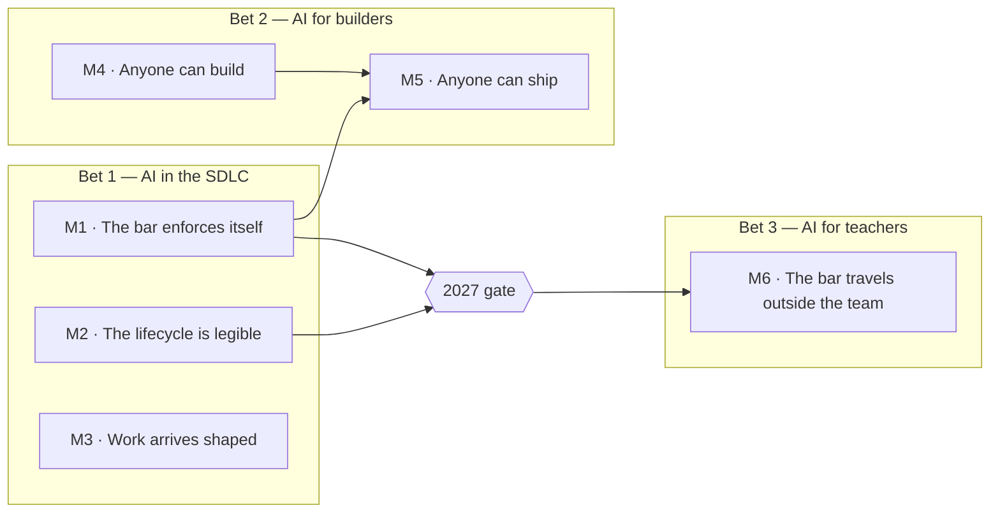

# Roadmap

**Last reviewed:** 2026-08-17 · **Owner:** Nicholas Lim

> Provisional filename. Settles once the delivery roadmap lands and we have picked which
> document owns the word "roadmap".

Six milestones for the harness, in dependency order. Each names a capability the harness
reaches, not the work that gets it there — how we get there is decided when we start, and
the delivery roadmap carries it from then on. Why these three bets is argued in
[STRATEGY.md](./STRATEGY.md).

## The shape

Arrows are dependencies, not calendar order. M3 has no prerequisite and no dependent: it can
run whenever there are people to run it.

## The milestones

| # | Capability | Landed when | Horizon |
|---|---|---|---|
| M1 | **The bar enforces itself.** Quality stops depending on someone noticing. What the standard can decide, the machine decides; where it cannot, it says so instead of passing silently. | No control promises a judgement it cannot make. | Now |
| M2 | **The lifecycle is legible.** We can see what the harness is asked to do, what it costs, and where it fails. | We can quote a median instead of an anecdote. | Now |
| M3 | **Work arrives shaped.** Intent becomes something buildable before it reaches a backlog, and the ceremonies around it produce the same result whoever ran them. | Someone hands over unshaped intent and gets back work another person can pick up unaided. | Next |
| M4 | **Anyone can build.** Discipline stops deciding whether you can get the product, and a change of your own, running. | Someone whose title is not engineer has their own change running, unaided. | Now |
| M5 | **Anyone can ship.** What a non-engineer built reaches production intact, through the same gates, rather than being handed over and rebuilt. | Something a non-engineer built is in production and was not rebuilt to get there. | Next |
| M6 | **The bar travels outside the team.** Teachers build against the same standard, with no specialist in the room. | A teacher-built surface is in production and passed the same gates as everything else. | Gated, 2027 |

**Why this order.** M1 is load-bearing twice over: M5 asks non-engineers to trust the gates,
and the 2027 gate asks teachers to depend on them entirely. M2 is what turns any claim in
this document into something a person can check. Everything else is sequenced by who is
available, not by dependency.

## The 2027 gate

Nothing in M6 starts until all four are true and this document's owner has signed the gate
open. The milestones above are deliberately wide; the gate is the one place that has to be
sharp, because a gate whose conditions are prose gets waived under pressure and nobody
notices.

- [ ] **M1 has landed**, verified against a deliberately bad surface without a person
      correcting the result.
- [ ] **M2 has landed**, with enough recorded runs to state a median rather than repeat one
      report.
- [ ] **A design run costs under five minutes of human attention**, taken from M2 rather than
      estimated. *Threshold to confirm; five minutes is a placeholder.*
- [ ] **The three open questions in the strategy have written answers**, in a form someone
      outside the team can read and disagree with.

Each is checkable by someone who did not build the thing being checked.

## Keeping this current

Move a horizon when it moves, and say when a milestone has not moved. If a milestone starts
attracting a list of things to build, that list belongs in the delivery roadmap, not here —
this document is meant to survive changing our minds about how.

No dates finer than a year and no issue links; both rot faster than this gets edited.
