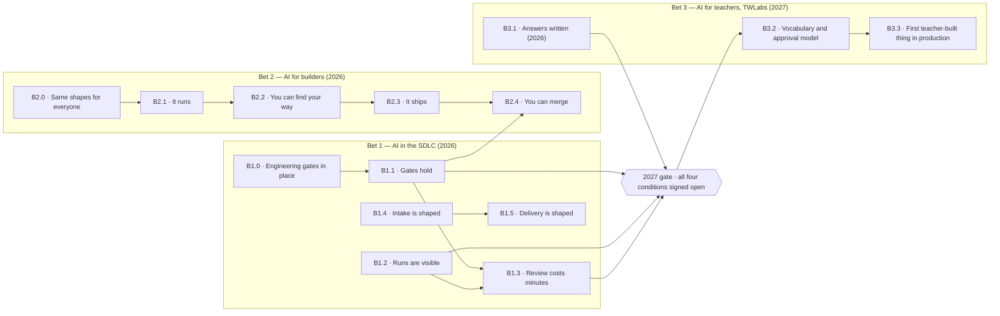

# Roadmap

**Last reviewed:** 2026-08-17 · **Owner:** Nicholas Lim

> Provisional filename. Settles once the delivery roadmap lands and we have picked which
> document owns the word "roadmap".

The milestones for the three bets, in dependency order. Why these bets and why in this
order is argued in [STRATEGY.md](./STRATEGY.md).

## The shape

Arrows are dependencies, not calendar order. Anything unconnected can run in parallel.

## Bet 1 — AI in the SDLC

| # | Milestone | Done when | Status |
|---|---|---|---|
| B1.0 | Engineering gates in place | Lint, formatting, pre-commit and pre-push gates, automated code review and dependency auditing run on our own repositories | Shipped |
| B1.1 | Gates hold | Every control claiming a deterministic check has one, and the set runs against a deliberately bad surface without a person correcting the result | In flight |
| B1.2 | Runs are visible | Skill usage, failure points and full run transcripts are recorded | Not started |
| B1.3 | Review costs minutes | Median human attention per design run is under five minutes, taken from B1.2 rather than estimated | Blocked on B1.1, B1.2 |
| B1.4 | Intake is shaped | Briefing returns a revised requirement with its changes recorded, and epic shaping turns product intent into a decidable backlog entry | Not started |
| B1.5 | Delivery is shaped | Grooming produces atomic pieces with dependencies and design scope explicit; sizing and definition of done are enforced at the gate, not in a meeting | Blocked on B1.4 |

## Bet 2 — AI for builders

| # | Milestone | Done when | Status |
|---|---|---|---|
| B2.0 | Same shapes for everyone | Issue authoring decides the shape of the work for any discipline; the design loop and its passes are usable end to end | Shipped |
| B2.1 | It runs | A non-engineer gets the product running, and a change of their own running inside it, without an engineer's help | Not started |
| B2.2 | You can find your way | Orientation answers where a surface lives, what it touches, and what breaks if it changes | Not started |
| B2.3 | It ships | What a non-engineer built reaches production without an engineer rebuilding it | Blocked on B2.2 |
| B2.4 | You can merge | Self-review clears low-risk work without an engineer approving it | Blocked on B1.1, B2.3 |

## Bet 3 — AI for teachers (TWLabs)

Working name, open definition. Nothing after the gate starts before the gate opens.

| # | Milestone | Done when | Status |
|---|---|---|---|
| B3.1 | Answers written | What a teacher builds, what the blast radius is, and who approves it, written so someone outside the team can disagree | Not started, owed in 2026 |
| B3.2 | Vocabulary and approval model | A teacher-facing vocabulary over the existing catalog, an approval model that works with nobody paid to own quality, and a blast-radius boundary | Gated |
| B3.3 | First teacher-built thing in production | One real teacher-built surface passes the same gates as everything else | Gated |

## The 2027 gate

All four checked, and signed open by this document's owner, before B3.2 starts. The
reasoning is in the strategy; these are the checkpoints.

- [ ] **B1.1** — every control claiming a deterministic check has one, verified against a
      deliberately bad surface.
- [ ] **B1.2** — enough recorded runs to state a median rather than repeat one report.
- [ ] **B1.3** — a design run costs under five minutes of human attention. *Threshold to
      confirm; five minutes is a placeholder.*
- [ ] **B3.1** — the three open questions have written answers.

Each is checkable by someone who did not build it. That is the point: a gate whose
conditions are prose gets waived under pressure and nobody notices.

## Keeping this current

Tick a checkpoint when it is true, not when it is close. Move a milestone's status when it
changes, and if a milestone has read "not started" for two reviews running, say so in the
row rather than leaving it to imply progress.

Near-horizon tracking lives in the delivery roadmap. No dates finer than a year and no issue
links here; both rot faster than this document gets edited.
