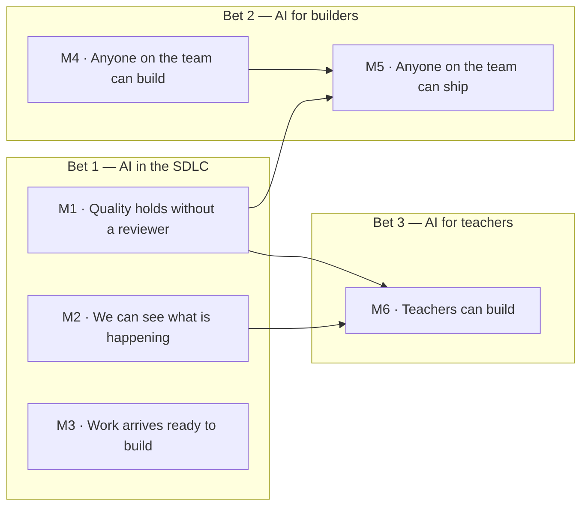

# Roadmap

**Last reviewed:** 2026-08-17 · **Owner:** Nicholas Lim

> Provisional filename. Settles once the delivery roadmap lands and we have picked which
> document owns the word "roadmap".

Six milestones for the harness, in dependency order. Each names a capability the harness
reaches, not the work that gets it there — how we get there is decided when we start, and
the delivery roadmap carries it from then on. Why these three bets is argued in
[STRATEGY.md](./STRATEGY.md).

## The shape

Arrows are dependencies, not calendar order. M3 has no prerequisite and no dependent: it can
run whenever there are people to run it.

## The milestones

| # | Capability | Landed when | Horizon |
|---|---|---|---|
| M1 | **Quality holds without a reviewer.** What a reviewer would look for is written down, across every axis of the work rather than design alone, and what can be decided by machine is. Where it cannot be, the machine says so instead of passing silently. The standard is expected to grow and be revised as we learn; what matters is that it never claims more than it can do. | A reviewer's checklist exists as controls rather than as habit, and none of them promises a judgement it cannot make. | Now |
| M2 | **We can see what is happening.** What the harness is asked to do, what it costs, and where it fails. | We can quote a median instead of an anecdote. | Now |
| M3 | **Work arrives ready to build.** Intent becomes something buildable before it reaches a backlog, and the ceremonies around it produce the same result whoever ran them. | Someone hands over unshaped intent and gets back work another person can pick up unaided. | Now |
| M4 | **Anyone on the team can build.** Discipline stops deciding whether you can get the product, and a change of your own, running. | Someone whose title is not engineer has their own change running, unaided. | Now |
| M5 | **Anyone on the team can ship.** What a non-engineer built reaches production intact, through the same gates, rather than being handed over and rebuilt. | Something a non-engineer built is in production and was not rebuilt to get there. | 2027 |
| M6 | **Teachers can build.** They build against the same standard, with no specialist in the room, and what they build reaches real use. | A teacher-built surface is in production and passed the same gates as everything else. | 2027 |

**Why this order.** M1 is load-bearing twice over: M5 asks non-engineers to trust the gates,
and M6 asks teachers to depend on them entirely, with no fallback of reading the catalog.
M5 needs the wider half of M1 in particular — someone shipping without an engineer's review
needs what that engineer would have checked to exist as a control, not as their judgement.
M2 is what turns any claim in this document into something a person can check. Everything
else is sequenced by who is available, not by dependency.

**On 2027.** Two milestones land there, M5 and M6, and they are the same problem twice:
work reaching production without the person who made it handing it to someone else. First
for a product team, then for a teacher. That makes 2026 the year the harness gets
trustworthy and usable, and 2027 the year it gets trusted with the last mile.

M6 is when we want to start, not a reward for finishing the others. How much of M1 and M2
has landed by then decides whether starting is a good idea, and what we would be accepting
if we start anyway. The strategy sets out that trade.

## Keeping this current

Move a horizon when it moves, and say when a milestone has not moved. If a milestone starts
attracting a list of things to build, that list belongs in the delivery roadmap, not here —
this document is meant to survive changing our minds about how.

No dates finer than a year and no issue links; both rot faster than this gets edited.
