# Roadmap

A living view of what the AI-first team is working on now, what's next, and how work reaches this list. Updated whenever a tracked epic or milestone issue is opened, closed, or re-scoped.

## How work reaches this roadmap

```mermaid
flowchart TD
    classDef phase fill:#ffffff,stroke:#555,stroke-width:1px,color:#222
    classDef designerOwner fill:#e6dcfb,stroke:#7c5cbf,color:#2c1a4d
    classDef pmOwner fill:#d6ecfb,stroke:#3f8fc9,color:#12324d
    classDef techleadOwner fill:#d7f7e2,stroke:#3fc97a,color:#0d3d1f
    classDef crossteamOwner fill:#fde8d4,stroke:#c98a3f,color:#4d2b0d
    classDef skill fill:#e3f2f1,stroke:#2f9e94,color:#0f3d3a
    classDef plannedSkill fill:#e3f2f1,stroke:#2f9e94,stroke-dasharray:4 3,color:#0f3d3a,font-style:italic
    classDef artifact fill:#f7f7f7,stroke:#999,stroke-dasharray:4 3,color:#333,font-style:italic
    classDef gap fill:#fdeaea,stroke:#c94f4f,stroke-dasharray:2 2,color:#5c1a1a,font-style:italic

    subgraph S1["1. Problem exploration"]
        direction LR
        subgraph S1a["Designer track"]
            direction TB
            ProtoOwner(["UI/UX<br/>designer"]):::designerOwner
            Proto["Prototyping"]:::phase
            ProtoSkill[["dx-design-execute"]]:::skill
            ArtProto[/"Figma prototype<br/>or vibe-coded prototype"/]:::artifact
            ProtoOwner --> Proto --> ProtoSkill --> ArtProto
        end
        subgraph S1b["PM track"]
            direction TB
            ReqOwner(["Product<br/>manager"]):::pmOwner
            Req["Requirements<br/>gathering"]:::phase
            ReqSkill[["dx-design-research-brief"]]:::skill
            ReqPlanned[["dx-create-epic<br/>(#18)"]]:::plannedSkill
            ArtPRD[/"PRD<br/>(Google Doc or .md)"/]:::artifact
            ReqOwner --> Req --> ReqSkill --> ReqPlanned --> ArtPRD
        end
    end

    subgraph S2["2. PRD briefing"]
        direction TB
        BriefOwner(["All teams<br/>/ roles"]):::crossteamOwner
        Brief["Cross-team<br/>briefing"]:::phase
        BriefGap[["no skill<br/>yet"]]:::gap
        ArtPRD2[/"Revised PRD +<br/>changelog entry"/]:::artifact
        BriefOwner --> Brief --> BriefGap --> ArtPRD2
    end

    subgraph S3["3. Epics & stories"]
        direction TB
        DraftOwner(["Product<br/>manager"]):::pmOwner
        Draft["Draft epics<br/>& stories"]:::phase
        DraftSkill[["dx-create-issue"]]:::skill
        DraftPlanned[["dx-create-story/task/<br/>chore/bug (#65-68)"]]:::plannedSkill
        ReviewOwner(["Tech<br/>lead"]):::techleadOwner
        Review["Review"]:::phase
        ReviewPlanned[["dx-create-issue as<br/>router (#69)"]]:::plannedSkill
        ArtIssues[/"Epics & stories<br/>filed as GitHub issues"/]:::artifact
        DraftOwner --> Draft --> DraftSkill --> DraftPlanned --> ReviewOwner --> Review --> ReviewPlanned --> ArtIssues
    end

    subgraph S4["4. Grooming"]
        direction TB
        GroomOwner(["Tech lead<br/>+ team"]):::techleadOwner
        Groom["Grooming"]:::phase
        GroomSkill[["dx-groom-issue,<br/>dx-split-issue"]]:::skill
        GroomPlanned[["design-scope<br/>linking (#19)"]]:::plannedSkill
        ArtSub[/"Technical sub-issues /<br/>design tickets"/]:::artifact
        GroomOwner --> Groom --> GroomSkill --> GroomPlanned --> ArtSub
    end

    subgraph S5["5. Downstream: implementation (beyond this SDLC, shown for full skill coverage)"]
        direction TB
        Build["Build &<br/>polish"]:::phase
        BuildSkill[["dx-design-execute,<br/>dx-design-critique, dx-design-copy,<br/>dx-design-flow, dx-design-pattern,<br/>dx-design-motion, dx-design-polish"]]:::skill
        Ship["Ship"]:::phase
        ShipSkill[["dx-implement-issue,<br/>dx-code-review, dx-lint-setup,<br/>dx-git-hooks-setup,<br/>dx-update-npm-dependencies"]]:::skill
        Build --> BuildSkill --> Ship --> ShipSkill
    end

    ArtProto --> BriefOwner
    ArtPRD --> BriefOwner
    ArtPRD2 --> DraftOwner
    ArtIssues --> GroomOwner
    ArtSub --> Build
```

Legend:

- **Stadium (pill)**, colored by role: purple = designer, blue = PM, green = tech lead, orange = cross-team. This is the phase **owner**.
- **Subroutine (double-border box)**, teal solid: an existing **skill** that covers this step. Teal dashed: a **planned** skill, not yet built. Red dashed: a step with **no skill yet** (gap).
- **Parallelogram**, grey dashed: the handover **artifact** produced by a step.
- **Rectangle**: the step itself.

Harness-wide meta skills not tied to a single phase: `dx-design-setup` (onboarding), `dx-design` (front door, grills intent and routes to the others), `dx-design-git` (git guidance), `dx-design-feedback` (harness self-feedback).

## Now

| Workstream | What's happening | Tracking issue(s) |
|---|---|---|
| Wayfinder: control-catalogue reliability spec (design-quality layer) | Grilling the design-quality artifact into shape: anchoring the four quality criteria, a register model for how `DESIGN.md` selects one, folding `layout-patterns.md` and the reviewer rubric in, wiring the quality layer into plan and verify, an accessibility check stack decision, a triage rubric for the 30 unscripted deterministic controls, and assembling the locked spec. This is the phase 2 (PRD briefing) gap on the diagram above, playing out for the harness's own control catalogue. | [#109](https://github.com/transformteamsg/dx-harness/issues/109) (epic), [#112](https://github.com/transformteamsg/dx-harness/issues/112), [#113](https://github.com/transformteamsg/dx-harness/issues/113), [#114](https://github.com/transformteamsg/dx-harness/issues/114), [#115](https://github.com/transformteamsg/dx-harness/issues/115), [#117](https://github.com/transformteamsg/dx-harness/issues/117), [#118](https://github.com/transformteamsg/dx-harness/issues/118), [#119](https://github.com/transformteamsg/dx-harness/issues/119) |
| Finish the `dx-create-issue` split | `dx-create-story` is in review; `dx-create-task` and rewiring `dx-create-issue` itself into a router are next up. `dx-create-chore` and `dx-create-bug` still need picking up. | [#22](https://github.com/transformteamsg/dx-harness/issues/22) (epic), [#65](https://github.com/transformteamsg/dx-harness/issues/65), [#66](https://github.com/transformteamsg/dx-harness/issues/66), [#67](https://github.com/transformteamsg/dx-harness/issues/67), [#68](https://github.com/transformteamsg/dx-harness/issues/68), [#69](https://github.com/transformteamsg/dx-harness/issues/69) |
| Website cleanup after the landing redesign | The redesign itself (hero, feature cards, skills section, full-map diagram, lime-on-black theme, copy sweep) has shipped; what's left is reconciling the rest of the site with it: stale `DESIGN.md`, mismatched skill names between landing and docs, missing proposed/settled badges, a stale layout direction contract, `/index.md` drift, and orphaned components. | [#71](https://github.com/transformteamsg/dx-harness/issues/71) (map), [#94](https://github.com/transformteamsg/dx-harness/issues/94), [#95](https://github.com/transformteamsg/dx-harness/issues/95), [#96](https://github.com/transformteamsg/dx-harness/issues/96), [#97](https://github.com/transformteamsg/dx-harness/issues/97), [#98](https://github.com/transformteamsg/dx-harness/issues/98), [#100](https://github.com/transformteamsg/dx-harness/issues/100) |

## Next

| Workstream | What's happening | Tracking issue(s) |
|---|---|---|
| Fill the two skill gaps this diagram exposes | `dx-create-epic` for PRD-level requirements grilling (problem exploration) and design-scope linking for the create-issue family (grooming). | [#18](https://github.com/transformteamsg/dx-harness/issues/18), [#19](https://github.com/transformteamsg/dx-harness/issues/19) |
| Product-management skill epic | Includes a dedicated bug-report skill, which likely folds into `dx-create-bug`. | [#43](https://github.com/transformteamsg/dx-harness/issues/43) (epic), [#44](https://github.com/transformteamsg/dx-harness/issues/44), [#68](https://github.com/transformteamsg/dx-harness/issues/68) |
| Harness-feedback backlog | `dx-groom-issue`'s missing comment-only mode, `dx-design`'s missing frontend-only/mock-data hybrid mode, the em-dash lint blind spot on wrapped JSX lines, an unimplemented SLP-4 nested-card check, and a `waiver-reconcile.py` bug dropping multi-control waiver rows. | [#42](https://github.com/transformteamsg/dx-harness/issues/42), [#41](https://github.com/transformteamsg/dx-harness/issues/41), [#27](https://github.com/transformteamsg/dx-harness/issues/27), [#127](https://github.com/transformteamsg/dx-harness/issues/127), [#126](https://github.com/transformteamsg/dx-harness/issues/126) |
| Open architecture questions | Moving toward Agent Plugins, and adopting STE100 as ubiquitous spec language. | [#46](https://github.com/transformteamsg/dx-harness/issues/46), [#47](https://github.com/transformteamsg/dx-harness/issues/47) |
| Observability | OpenTelemetry for skill usage, and capturing full eval transcripts instead of just the final message. | [#23](https://github.com/transformteamsg/dx-harness/issues/23), [#17](https://github.com/transformteamsg/dx-harness/issues/17) |
| Software license checker skill | Not yet started. | [#45](https://github.com/transformteamsg/dx-harness/issues/45) |
| Efficacy report | Trial `dx-design` on a small issue and write up what worked. | [#38](https://github.com/transformteamsg/dx-harness/issues/38) |

## Recently shipped

| Workstream | What shipped | Issue(s) |
|---|---|---|
| Design-loop rebuild | The `dx-design` orchestrator, a slimmed intent/diverge loop, propose-only passes, `dx-design-critique`, `dx-design-language`, `dx-design-git`, and `dx-design-setup`, plus the skills-restructure spec, the rename to the `dx-design-*` family with stub shims, and the shared-procedures extraction that backs them all. | [#55](https://github.com/transformteamsg/dx-harness/issues/55), [#56](https://github.com/transformteamsg/dx-harness/issues/56), [#57](https://github.com/transformteamsg/dx-harness/issues/57), [#58](https://github.com/transformteamsg/dx-harness/issues/58), [#59](https://github.com/transformteamsg/dx-harness/issues/59), [#60](https://github.com/transformteamsg/dx-harness/issues/60), [#61](https://github.com/transformteamsg/dx-harness/issues/61), [#62](https://github.com/transformteamsg/dx-harness/issues/62), [#63](https://github.com/transformteamsg/dx-harness/issues/63), [#64](https://github.com/transformteamsg/dx-harness/issues/64) |
| Structured issue relationships | Epics and mid-grooming splits wired into `dx-create-story`, `dx-create-task`, `dx-create-chore`, `dx-create-bug`, `dx-groom-issue`, and `dx-split-issue`. | [#51](https://github.com/transformteamsg/dx-harness/issues/51), [#52](https://github.com/transformteamsg/dx-harness/issues/52), [#53](https://github.com/transformteamsg/dx-harness/issues/53) |
| Landing-page redesign build-out | Lime-on-black theme, hero, feature cards, skills section, full-map diagram, and a full-page copy sweep. | [#73](https://github.com/transformteamsg/dx-harness/issues/73)-[#82](https://github.com/transformteamsg/dx-harness/issues/82) |
| First-end-to-end-run fixes | Standards-catalogue gaps, a `validate.py` path-resolution bug, and skill directories mismatched with their frontmatter names. | [#121](https://github.com/transformteamsg/dx-harness/issues/121), [#122](https://github.com/transformteamsg/dx-harness/issues/122), [#123](https://github.com/transformteamsg/dx-harness/issues/123) |
| Research spikes | What the inspiration skills encode that the harness doesn't, and off-the-shelf replacements for the four bespoke scanners. | [#111](https://github.com/transformteamsg/dx-harness/issues/111), [#116](https://github.com/transformteamsg/dx-harness/issues/116) |

_Workstreams move here when their tracking epic closes, then get pruned at the next review._
