# Roadmap

A living view of what the AI-first team is working on now, what's next, and how work reaches this list. Updated whenever a tracked epic or milestone issue is opened, closed, or re-scoped.

## Now

| Workstream | What's happening | Tracking issue(s) |
|---|---|---|
| Control-catalogue reliability spec: build-out | The spec that used to live here as a Wayfinder effort is locked ([#109](https://github.com/transformteamsg/dx-harness/issues/109), closed); this is implementing it. Nine of eighteen sub-issues have shipped: a prototype grading run, the catalogue's gap field and its 11 relabels, the static accessibility check rebuilt on `jsx-a11y`, `type-scan` and `token-audit` moved to `ast-grep`, `content-lint` scoped to user-facing strings, the axe-core/Playwright rendered-check runner, and two more structural checks. Left to do: adopt `quality-bar.md` and fold in the reviewer rubric and `layout-patterns.md`, add a register selector to `dx-design-language`, wire the quality bar into plan and verify, five more deterministic check scripts, then a coverage recount. | [#144](https://github.com/transformteamsg/dx-harness/issues/144) (epic), [#147](https://github.com/transformteamsg/dx-harness/issues/147)-[#149](https://github.com/transformteamsg/dx-harness/issues/149), [#155](https://github.com/transformteamsg/dx-harness/issues/155)-[#159](https://github.com/transformteamsg/dx-harness/issues/159), [#162](https://github.com/transformteamsg/dx-harness/issues/162) |
| L0 accessibility check gating | Three L0 controls were promising machine enforcement that nothing delivered; wiring them up as three independent PRs, each of which already found a real defect on the way in. | [#205](https://github.com/transformteamsg/dx-harness/issues/205), [#210](https://github.com/transformteamsg/dx-harness/pull/210), [#211](https://github.com/transformteamsg/dx-harness/pull/211), [#212](https://github.com/transformteamsg/dx-harness/pull/212) |
| Issue-skill housekeeping | A repo-root contributing guide and a new `dx-create-pr` skill (opens and updates pull requests) are both in review. Queued next: a chore epic to move the duplicated `gh` mechanics and the backlog dependency scan out of every issue skill and into `procedures/`, and pin the shared rule wording against drift. | [#213](https://github.com/transformteamsg/dx-harness/issues/213), [#215](https://github.com/transformteamsg/dx-harness/issues/215), [#219](https://github.com/transformteamsg/dx-harness/issues/219) (epic), [#220](https://github.com/transformteamsg/dx-harness/issues/220)-[#222](https://github.com/transformteamsg/dx-harness/issues/222) |
| Website reconciliation after two more landing rebuilds | The landing page has moved twice since the redesign-cleanup list below was filed: the illustrated rebuild ([#183](https://github.com/transformteamsg/dx-harness/issues/183)), the `/note` postcard ([#206](https://github.com/transformteamsg/dx-harness/issues/206)), the docs Reference-group retirement ([#207](https://github.com/transformteamsg/dx-harness/issues/207)), and the Google style-guide adoption ([#208](https://github.com/transformteamsg/dx-harness/issues/208), [#223](https://github.com/transformteamsg/dx-harness/issues/223)). Of the original cleanup list, the orphaned-components chore and the stale layout direction-contract fix look already resolved in the current code; the proposed/settled badge ask is superseded by a deliberate decision not to carry that status axis on published docs. Still open and unverified against the current page: the skill-name mismatch between landing and docs, `DESIGN.md` drift, `/index.md` drift, and a live bug where the dark landing sits on a light page canvas. | [#71](https://github.com/transformteamsg/dx-harness/issues/71) (map, closed), [#94](https://github.com/transformteamsg/dx-harness/issues/94), [#95](https://github.com/transformteamsg/dx-harness/issues/95), [#98](https://github.com/transformteamsg/dx-harness/issues/98), [#99](https://github.com/transformteamsg/dx-harness/issues/99), [#93](https://github.com/transformteamsg/dx-harness/issues/93), [#96](https://github.com/transformteamsg/dx-harness/issues/96), [#97](https://github.com/transformteamsg/dx-harness/issues/97), [#100](https://github.com/transformteamsg/dx-harness/issues/100) |

## Next

| Workstream | What's happening | Tracking issue(s) |
|---|---|---|
| `dx-code-review` rework | A fresh epic assessed against four external review philosophies (GitHub, Google, Claude Code, Codex custom rules). Eleven sub-issues, ordered: two bugs and a chore first, then a volume cap (blocks two of the new angles), then five stories including per-repository tuning instructions and GitLab merge-request support, then the security and design angles last. Not yet started. | [#216](https://github.com/transformteamsg/dx-harness/issues/216) (epic), [#228](https://github.com/transformteamsg/dx-harness/issues/228)-[#238](https://github.com/transformteamsg/dx-harness/issues/238) |
| Fill the remaining skill gap this diagram exposes | Design-scope linking for the create-issue family shipped, folded into the structured-issue-relationships work. `dx-create-epic` for PRD-level requirements grilling is the one gap left. | [#18](https://github.com/transformteamsg/dx-harness/issues/18) |
| Product-management skill epic | `dx-create-bug` shipped as part of the four-shapes rebuild below, so the standalone bug-report request looks superseded and may just need closing. | [#43](https://github.com/transformteamsg/dx-harness/issues/43) (epic), [#44](https://github.com/transformteamsg/dx-harness/issues/44) |
| Standards catalogue: five new controls proposed | Awaiting triage: WCAG 2.2.2 stoppability and 1.4.5 images of text, decorative-layer governance, a surface's auto-fetched media budget, TYP-2's one-sided line-height band, and animation- or interaction-induced layout shift. | [#200](https://github.com/transformteamsg/dx-harness/issues/200)-[#204](https://github.com/transformteamsg/dx-harness/issues/204) |
| Harness-feedback backlog | Grown to thirteen open items: `dx-groom-issue`'s missing comment-only mode, `dx-design`'s missing frontend-only/mock-data hybrid mode and a modification path that skips diverge, the em-dash lint blind spot on wrapped JSX lines and its contradiction with `emit_error`, two uncaught defect classes (live-region collision, handler-less control) plus a `token-audit`/A11Y-3 contradiction, an unimplemented SLP-4 nested-card check, a `waiver-reconcile.py` bug, `dx-implement-issue`'s stale PR template and its own em-dash contradiction, a roughly 24-minute design-review runtime, and `dx-design-git`'s missing branch-scope guidance. | [#127](https://github.com/transformteamsg/dx-harness/issues/127), [#133](https://github.com/transformteamsg/dx-harness/issues/133), [#172](https://github.com/transformteamsg/dx-harness/issues/172), [#41](https://github.com/transformteamsg/dx-harness/issues/41), [#171](https://github.com/transformteamsg/dx-harness/issues/171), [#164](https://github.com/transformteamsg/dx-harness/issues/164), [#27](https://github.com/transformteamsg/dx-harness/issues/27), [#170](https://github.com/transformteamsg/dx-harness/issues/170), [#134](https://github.com/transformteamsg/dx-harness/issues/134), [#128](https://github.com/transformteamsg/dx-harness/issues/128), [#126](https://github.com/transformteamsg/dx-harness/issues/126), [#197](https://github.com/transformteamsg/dx-harness/issues/197), [#42](https://github.com/transformteamsg/dx-harness/issues/42) |
| Open architecture questions | Moving toward Agent Plugins, and adopting STE100 as ubiquitous spec language. | [#46](https://github.com/transformteamsg/dx-harness/issues/46), [#47](https://github.com/transformteamsg/dx-harness/issues/47) |
| Observability | OpenTelemetry for skill usage, and capturing full eval transcripts instead of just the final message. | [#23](https://github.com/transformteamsg/dx-harness/issues/23), [#17](https://github.com/transformteamsg/dx-harness/issues/17) |
| Software license checker skill | Not yet started. | [#45](https://github.com/transformteamsg/dx-harness/issues/45) |
| Efficacy report | The first trial ran `dx-design` twice on a large, ambiguous ticket; its own verdict was not yet recommended for an engineer without designer input, though several of its findings shipped as fixes already. The recommended next step, trialing on a smaller issue, is still open. | [#38](https://github.com/transformteamsg/dx-harness/issues/38) |

## Recently shipped

| Workstream | What shipped | Issue(s) |
|---|---|---|
| Control-catalogue reliability spec locked | The four design-quality criteria anchored, a register model for how `DESIGN.md` selects one, `layout-patterns.md` and the reviewer rubric folded into scope, the accessibility check-stack decision, and a triage rubric for the 30 unscripted deterministic controls, assembled into a locked spec. This was the phase 2 (PRD briefing) gap on the diagram above, playing out for the harness's own control catalogue. Implementation continues as [#144](https://github.com/transformteamsg/dx-harness/issues/144), above. | [#109](https://github.com/transformteamsg/dx-harness/issues/109) (epic), [#112](https://github.com/transformteamsg/dx-harness/issues/112)-[#115](https://github.com/transformteamsg/dx-harness/issues/115), [#117](https://github.com/transformteamsg/dx-harness/issues/117)-[#119](https://github.com/transformteamsg/dx-harness/issues/119) |
| Issue creation rebuilt around four shapes | `dx-create-story`, `dx-create-task`, `dx-create-chore`, and `dx-create-bug` each own their intake and template; `dx-create-issue` is now a front door that asks which shape the work is and routes to it. Shipped as plugin `0.5.0` in one PR, which also removed a grooming gate in `dx-implement-issue` that blocked every issue the new model produces. GitHub still shows #22, #67, and #68 open—closing them is bookkeeping, not remaining work. | [#178](https://github.com/transformteamsg/dx-harness/issues/178), closes [#22](https://github.com/transformteamsg/dx-harness/issues/22), [#65](https://github.com/transformteamsg/dx-harness/issues/65)-[#69](https://github.com/transformteamsg/dx-harness/issues/69) |
| tfx:design efficacy-report fixes | Issue-initiated intake, a hand-off flow with a mode-dependent plan-approval gate, AC-to-E2E test mapping, reviewer routing, an E2E/axe-core scan at verify, and a PR-body template, all based on findings from the two-run efficacy report. | [#37](https://github.com/transformteamsg/dx-harness/pull/37) |
| Design-loop rebuild | The `dx-design` orchestrator, a slimmed intent/diverge loop, propose-only passes, `dx-design-critique`, `dx-design-language`, `dx-design-git`, and `dx-design-setup`, plus the skills-restructure spec, the rename to the `dx-design-*` family with stub shims, and the shared-procedures extraction that backs them all. | [#55](https://github.com/transformteamsg/dx-harness/issues/55), [#56](https://github.com/transformteamsg/dx-harness/issues/56), [#57](https://github.com/transformteamsg/dx-harness/issues/57), [#58](https://github.com/transformteamsg/dx-harness/issues/58), [#59](https://github.com/transformteamsg/dx-harness/issues/59), [#60](https://github.com/transformteamsg/dx-harness/issues/60), [#61](https://github.com/transformteamsg/dx-harness/issues/61), [#62](https://github.com/transformteamsg/dx-harness/issues/62), [#63](https://github.com/transformteamsg/dx-harness/issues/63), [#64](https://github.com/transformteamsg/dx-harness/issues/64) |
| Structured issue relationships | Epics and mid-grooming splits wired into `dx-create-story`, `dx-create-task`, `dx-create-chore`, `dx-create-bug`, `dx-groom-issue`, and `dx-split-issue`, including design-scope linking for the same skill family. | [#19](https://github.com/transformteamsg/dx-harness/issues/19), [#51](https://github.com/transformteamsg/dx-harness/issues/51), [#52](https://github.com/transformteamsg/dx-harness/issues/52), [#53](https://github.com/transformteamsg/dx-harness/issues/53) |
| Landing-page redesign build-out | Lime-on-black theme, hero, feature cards, skills section, full-map diagram, and a full-page copy sweep. | [#73](https://github.com/transformteamsg/dx-harness/issues/73)-[#82](https://github.com/transformteamsg/dx-harness/issues/82) |
| First-end-to-end-run fixes | Standards-catalogue gaps, a `validate.py` path-resolution bug, and skill directories mismatched with their frontmatter names. | [#121](https://github.com/transformteamsg/dx-harness/issues/121), [#122](https://github.com/transformteamsg/dx-harness/issues/122), [#123](https://github.com/transformteamsg/dx-harness/issues/123) |
| Research spikes | What the inspiration skills encode that the harness doesn't, and off-the-shelf replacements for the four bespoke scanners. | [#111](https://github.com/transformteamsg/dx-harness/issues/111), [#116](https://github.com/transformteamsg/dx-harness/issues/116) |

_Workstreams move here when their tracking epic closes, then get pruned at the next review._

## How work reaches this roadmap

```mermaid
flowchart TD
    classDef phase fill:#ffffff,stroke:#555,stroke-width:1px,color:#222
    classDef designerOwner fill:#e6dcfb,stroke:#7c5cbf,color:#2c1a4d
    classDef pmOwner fill:#d6ecfb,stroke:#3f8fc9,color:#12324d
    classDef techleadOwner fill:#d7f7e2,stroke:#3fc97a,color:#0d3d1f
    classDef crossteamOwner fill:#fde8d4,stroke:#c98a3f,color:#4d2b0d
    classDef skill fill:#e3f2f1,stroke:#2f9e94,color:#0f3d3a
    classDef plannedSkill fill:#e3f2f1,stroke:#2f9e94,stroke-dasharray:4 3,color:#0f3d3a,font-style:italic
    classDef artifact fill:#f7f7f7,stroke:#999,stroke-dasharray:4 3,color:#333,font-style:italic
    classDef gap fill:#fdeaea,stroke:#c94f4f,stroke-dasharray:2 2,color:#5c1a1a,font-style:italic

    subgraph S1["1. Problem exploration"]
        direction LR
        subgraph S1a["Designer track"]
            direction TB
            ProtoOwner(["UI/UX<br/>designer"]):::designerOwner
            Proto["Prototyping"]:::phase
            ProtoSkill[["dx-design-execute"]]:::skill
            ArtProto[/"Figma prototype<br/>or vibe-coded prototype"/]:::artifact
            ProtoOwner --> Proto --> ProtoSkill --> ArtProto
        end
        subgraph S1b["PM track"]
            direction TB
            ReqOwner(["Product<br/>manager"]):::pmOwner
            Req["Requirements<br/>gathering"]:::phase
            ReqSkill[["dx-design-research-brief"]]:::skill
            ReqPlanned[["dx-create-epic<br/>(#18)"]]:::plannedSkill
            ArtPRD[/"PRD<br/>(Google Doc or .md)"/]:::artifact
            ReqOwner --> Req --> ReqSkill --> ReqPlanned --> ArtPRD
        end
    end

    subgraph S2["2. PRD briefing"]
        direction TB
        BriefOwner(["All teams<br/>/ roles"]):::crossteamOwner
        Brief["Cross-team<br/>briefing"]:::phase
        BriefGap[["no skill<br/>yet"]]:::gap
        ArtPRD2[/"Revised PRD +<br/>changelog entry"/]:::artifact
        BriefOwner --> Brief --> BriefGap --> ArtPRD2
    end

    subgraph S3["3. Epics & stories"]
        direction TB
        DraftOwner(["Product<br/>manager"]):::pmOwner
        Draft["Draft epics<br/>& stories"]:::phase
        DraftSkill[["dx-create-issue"]]:::skill
        DraftPlanned[["dx-create-story/task/<br/>chore/bug"]]:::skill
        ReviewOwner(["Tech<br/>lead"]):::techleadOwner
        Review["Review"]:::phase
        ReviewPlanned[["dx-create-issue as<br/>router"]]:::skill
        ArtIssues[/"Epics & stories<br/>filed as GitHub issues"/]:::artifact
        DraftOwner --> Draft --> DraftSkill --> DraftPlanned --> ReviewOwner --> Review --> ReviewPlanned --> ArtIssues
    end

    subgraph S4["4. Grooming"]
        direction TB
        GroomOwner(["Tech lead<br/>+ team"]):::techleadOwner
        Groom["Grooming"]:::phase
        GroomSkill[["dx-groom-issue,<br/>dx-split-issue"]]:::skill
        GroomPlanned[["design-scope<br/>linking"]]:::skill
        ArtSub[/"Technical sub-issues /<br/>design tickets"/]:::artifact
        GroomOwner --> Groom --> GroomSkill --> GroomPlanned --> ArtSub
    end

    subgraph S5["5. Downstream: implementation (beyond this SDLC, shown for full skill coverage)"]
        direction TB
        Build["Build &<br/>polish"]:::phase
        BuildSkill[["dx-design-execute,<br/>dx-design-critique, dx-design-copy,<br/>dx-design-flow, dx-design-pattern,<br/>dx-design-motion, dx-design-polish"]]:::skill
        Ship["Ship"]:::phase
        ShipSkill[["dx-implement-issue,<br/>dx-code-review, dx-lint-setup,<br/>dx-git-hooks-setup,<br/>dx-update-npm-dependencies"]]:::skill
        Build --> BuildSkill --> Ship --> ShipSkill
    end

    ArtProto --> BriefOwner
    ArtPRD --> BriefOwner
    ArtPRD2 --> DraftOwner
    ArtIssues --> GroomOwner
    ArtSub --> Build
```

Legend:

- **Stadium (pill)**, colored by role: purple = designer, blue = PM, green = tech lead, orange = cross-team. This is the phase **owner**.
- **Subroutine (double-border box)**, teal solid: an existing **skill** that covers this step. Teal dashed: a **planned** skill, not yet built. Red dashed: a step with **no skill yet** (gap).
- **Parallelogram**, grey dashed: the handover **artifact** produced by a step.
- **Rectangle**: the step itself.

Harness-wide meta skills not tied to a single phase: `dx-design-setup` (onboarding), `dx-design` (front door, grills intent and routes to the others), `dx-design-git` (git guidance), `dx-design-feedback` (harness self-feedback).