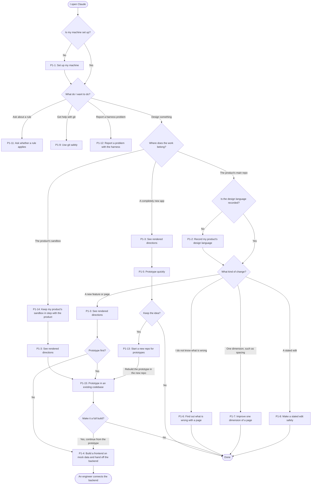

# P1: designer who builds in code

Part of the [design revamp stories](README.md). Confirmed through [#415](https://github.com/transformteamsg/dx-harness/issues/415).

- **Background:** UI or UX designer with no engineering background. New to git. May use Claude Desktop.
- **What they want from the harness:** Turn a design idea into working UI that meets the standard, without an engineer and without breaking the codebase. The harness decides where a default exists and uses no harness vocabulary ([#164](https://github.com/transformteamsg/dx-harness/issues/164)).
- **Priority:** Primary persona. Where the needs of two personas conflict, the architecture optimises for P1.

**Stories**

- [P1-1: Set up my machine](#p1-1-set-up-my-machine)
- [P1-2: Record my product's design language](#p1-2-record-my-products-design-language)
- [P1-3: See rendered directions](#p1-3-see-rendered-directions)
- [P1-4: Build a frontend on mock data and hand off the backend](#p1-4-build-a-frontend-on-mock-data-and-hand-off-the-backend)
- [P1-5: Prototype quickly](#p1-5-prototype-quickly)
- [P1-6: Find out what is wrong with a page](#p1-6-find-out-what-is-wrong-with-a-page)
- [P1-7: Improve one dimension of a page](#p1-7-improve-one-dimension-of-a-page)
- [P1-8: Make a stated edit safely](#p1-8-make-a-stated-edit-safely)
- [P1-9: Use git safely](#p1-9-use-git-safely)
- [P1-10: Keep records without being asked](#p1-10-keep-records-without-being-asked)
- [P1-11: Ask whether a rule applies](#p1-11-ask-whether-a-rule-applies)
- [P1-12: Report a problem with the harness](#p1-12-report-a-problem-with-the-harness)
- [P1-13: Start a new repo for prototypes](#p1-13-start-a-new-repo-for-prototypes)
- [P1-14: Keep my product's sandbox in step with the product](#p1-14-keep-my-products-sandbox-in-step-with-the-product)
- [P1-15: Prototype in an existing codebase](#p1-15-prototype-in-an-existing-codebase)

**Journey**

Each branch is a decision that the designer makes. P1-9 and P1-10 also apply at every build, and P1-12 applies at any step.

## P1-1: Set up my machine

As a designer who builds in code, I want my machine set up for the harness in one guided session, so that my first design run does not fail on a missing tool.

**Acceptance examples**

- Given a machine with none of the harness tools, when I run setup, then it installs each missing tool and reports at the end that every tool is ready.
- Given Claude Desktop with no terminal open, when a step needs me to sign in to GitHub, then setup tells me what to click or type in the app, and no step asks me to open a terminal.
- Given a machine that is already set up, when I run setup again, then it changes nothing and reports that every tool is ready.

**Today:** `dx-design-setup`. **Gap:** Commit signing is not design-specific. The GitHub sign-in step needs a terminal.

## P1-2: Record my product's design language

As a designer who builds in code, I want to record my product's design language from my code, Figma, or brand documents, so that every run builds to it.

**Acceptance examples**

- Given a repo with colour and type tokens in its code, when I record the design language, then the harness drafts `DESIGN.md` from the code and asks me only to confirm or correct it.
- Given a Figma file and a brand document that set different primary colours, when I record the design language, then the harness asks me once which source wins.
- Given a repo for prototypes with no design language, when I record one, then I can choose an existing design language, such as Teacher Workspace, instead of defining one.

**Today:** `dx-design-language`. **Gap:** None.

## P1-3: See rendered directions

As a designer who builds in code, I want to see two or three rendered directions for a new page or a visual change, so that I choose between things I can see.

**Acceptance examples**

- Given a new feature, when the run starts, then I see three to five greyscale wireframes before any hifi direction.
- Given a chosen wireframe, when the hifi directions render, then each one keeps the structure of that wireframe.
- Given a request for a new page, when the run offers directions, then I see two or three of them rendered before the harness builds one.
- Given a visual change to an existing page, such as a new header colour, when the run starts, then I also see two or three rendered directions.
- Given Claude Desktop, when the directions are ready, then I see each one in the app's preview, and I do not open a file path to see it.
- Given three rendered directions, when I choose one, then the harness builds that direction only.

**Today:** The diverge step of `dx-design-execute`. **Gap:** The diverge step skips visual changes ([#134](https://github.com/transformteamsg/dx-harness/issues/134)). The diverge step has no wireframe round.

## P1-4: Build a frontend on mock data and hand off the backend

As a designer who builds in code, I want to build a working frontend on mock data and hand the backend to an engineer, so that I can test the design end to end.

**Acceptance examples**

- Given a product repo with a real backend, when I build a page on mock data, then all the mock data sits in one place that an engineer replaces, and no file that calls the backend changes.
- Given a page built on mock data, when I hand it off, then the engineer gets a spec that lists each data source the page needs and the shape of its data.
- Given a story with acceptance criteria, when the build finishes, then each criterion has an end-to-end test that passes on the mock data.

**Today:** None. **Gap:** The hand-off modes were in `issue-intake.md`, which no skill links to ([#41](https://github.com/transformteamsg/dx-harness/issues/41)).

## P1-5: Prototype quickly

As a designer who builds in code, I want a quick prototype of a completely new app, without the full loop, so that I can test an idea before I commit to it.

**Acceptance examples**

- Given a prototype of a completely new app, when it is built, then it is plain HTML that opens in Claude Desktop with no install.
- Given a new idea with no repo, when I prototype it, then the harness builds it and does not create a repo.
- Given a prototype of a new app, when I start a second prototype for the same app, then the harness builds it beside the first and does not change the first.
- Given a product's sandbox, when I start a prototype of a completely new app, then the harness starts it outside the sandbox and does not build it there.
- Given a quick prototype, when it is built, then the checks for unsafe and inaccessible output still run, and the plan approval and the design review do not.
- Given a quick prototype, when it is built, then no coding standards check runs.
- Given a plain HTML prototype that I want to keep, when I say so, then the harness offers to start a repo for the app.

**Today:** None. **Gap:** `dx-design-execute` runs every gate. No skill tells a new app from an existing codebase.

## P1-6: Find out what is wrong with a page

As a designer who builds in code, I want to ask what is wrong with a page and get ranked suggestions, so that I know where to start.

**Acceptance examples**

- Given a page, when I ask what is wrong with it, then I get suggestions ranked by importance, and each one names the part of the page that it applies to.
- Given the suggestions, when I read them, then they are in plain language, and a rule code appears only as a reference.
- Given a page with no problems, when I ask what is wrong with it, then the harness says so in one line.
- Given the suggestions, when I accept one, then the harness builds it, and I do not restate it.

**Today:** `dx-design-critique`. **Gap:** The report is heavy.

## P1-7: Improve one dimension of a page

As a designer who builds in code, I want to improve one dimension of a page (spacing, copy, motion, flow, or structure), so that I fix it without a full critique.

**Acceptance examples**

- Given a page, when I ask to improve its spacing, then every suggestion is about spacing.
- Given a page, when I ask to improve its copy, then I get suggestions about the words only, and no suggestion about colour or layout.
- Given an accepted spacing suggestion, when the harness builds it, then only the spacing on the page changes.

**Today:** Five pass skills. **Gap:** Five skills do one job.

## P1-8: Make a stated edit safely

As a designer who builds in code, I want to make a stated edit, such as "change the label to Save", with the standard still applied, so that small changes stay safe.

**Acceptance examples**

- Given the request "change the label to Save", when the harness makes the edit, then it does not ask me to choose a direction or approve a plan.
- Given a stated edit that breaks a rule, such as a text colour with too little contrast, when I ask for it, then the harness tells me before it builds and offers a value that passes.
- Given a stated edit, when it is made, then nothing else on the page changes.

**Today:** The modification path of `dx-design-execute`. **Gap:** None.

## P1-9: Use git safely

As a designer who builds in code, I want git explained and done with me safely, so that I never break the shared branch.

**Acceptance examples**

- Given I am on the shared branch, when a build is about to start, then the harness explains the risk in one plain line and starts a new branch only after I agree.
- Given my branch is behind the shared branch, when a build is about to start, then the harness offers to update my branch first and waits for my answer.
- Given I ask "is my work saved?", when the harness answers, then it tells me the state of my repo in plain words and names the git term once.
- Given Claude Desktop with no terminal open, when I want to save and share my work, then the harness does each git step with me in the conversation.

**Today:** `dx-design-git`. **Gap:** The persona voice is heavy.

## P1-10: Keep records without being asked

As a designer who builds in code, I want the harness to keep its records without asking me where they go, so that I can focus on the design.

**Acceptance examples**

- Given a finished run, when the harness records it, then it does not ask me where the record goes.
- Given any run, when it finishes, then the decision record is the only record it writes, and it creates no design ticket.
- Given a run that needs a decision from me, when the harness asks, then it shows a drafted answer and asks for a yes or no.

**Today:** `procedures/design-tickets.md`. **Gap:** The skills ask where records go ([#164](https://github.com/transformteamsg/dx-harness/issues/164)). The rebuild keeps the decision record as the only record ([#364](https://github.com/transformteamsg/dx-harness/issues/364)).

## P1-11: Ask whether a rule applies

As a designer who builds in code, I want to ask whether a rule applies or how to waive it, so that I proceed without guessing.

**Acceptance examples**

- Given a rule and a page, when I ask whether the rule applies to the page, then I get a yes or a no and a one-line reason.
- Given a rule that I want to waive, when I ask how, then the harness drafts the waiver with a reason and asks me for a yes or no.
- Given a question about a rule, when the harness answers, then it does not first show me a menu of other options.

**Today:** Section 6 of `dx-design`. **Gap:** The answer is buried in the router.

## P1-12: Report a problem with the harness

As a designer who builds in code, I want to report a problem with the harness during a task, so that the maintainers hear about it.

**Acceptance examples**

- Given a task in progress, when I say that a step of the harness confused me, then the harness drafts a feedback issue, shows it to me, and files it after I agree.
- Given filed feedback, when the harness returns to my task, then the task continues from the step where it stopped.
- Given feedback about my product's design, not about the harness, when I give it, then the harness does not file it as harness feedback.

**Today:** `dx-design-feedback`. **Gap:** None.

## P1-13: Start a new repo for prototypes

As a designer who builds in code, I want to start a repo for a new app in the stack that our production apps use, so that its prototypes and its later product do not drift apart.

**Acceptance examples**

- Given a plain HTML prototype that I want to keep, when I ask for a repo, then the harness creates it on GitHub in the production stack, after I confirm the name and the owner.
- Given a new repo, when the harness creates it, then it rebuilds the plain HTML prototype in the repo with the stack's components.
- Given a new repo, when the harness creates it, then a design language is recorded, either an existing one that I choose or one that I define in the same session.
- Given a new repo, when I start my next prototype in it, then the run needs no further setup.

**Today:** None. **Gap:** No skill creates a repo. Nothing records the stack that the production apps use.

## P1-14: Keep my product's sandbox in step with the product

As a designer who builds in code, I want my product's sandbox kept in step with what the product ships, so that every new design starts from the current components.

**Acceptance examples**

- Given the product's sandbox, when I start a new design, then the harness checks which shipped components differ from the main repo before it builds.
- Given a shipped component that differs, when the check finds it, then the harness shows me the two versions rendered side by side.
- Given a shipped component that differs, when I agree to sync it, then the harness replaces the sandbox copy with the main repo's version, and it changes nothing without my agreement.
- Given a prototype behind a feature flag that the main repo does not ship, when the sandbox syncs, then the prototype does not change.
- Given no difference, when the check finishes, then the harness says so in one line and starts the design.

**Today:** None. **Gap:** The drift check in `dx-design-language` compares code with `DESIGN.md` in one repo only. No skill compares a sandbox with the main repo or syncs it.

## P1-15: Prototype in an existing codebase

As a designer who builds in code, I want to prototype a feature on top of my product's existing codebase without the full loop, so that I test it in the real app and do not break the codebase.

**Acceptance examples**

- Given a product repo or its sandbox, when I ask for a prototype, then the harness builds it on a new branch on mock data, and the shared branch does not change.
- Given a prototype in a product codebase, when the hifi is built, then it uses the app's own components.
- Given a prototype in a product codebase, when it is built, then the codebase's own coding standards checks run in full, such as its lint, type check, and tests.
- Given a prototype in a product codebase, when it is built, then the checks for unsafe and inaccessible output still run, and the plan approval and the design review do not.
- Given a prototype in a product codebase, when I finish it, then the harness does not merge it into the shared branch until I make it a full build.
- Given a finished prototype in a product codebase, when I ask to make it a full build, then the run continues from the prototype with the plan approval and the design review.

**Today:** None. **Gap:** `dx-design-execute` runs every gate and has no prototype path for a product codebase.
