# TFX design-skill efficacy report

**Subject:** the `tfx:design` harness (six-phase loop: Intent → Diverge → Plan → Implement →
Verify → Ratchet), evaluated against two independent runs on the same issue. The harness
ships as a plugin — named `atelier` at the time both runs in this report were done; since
renamed to `dx-harness`
([transformteamsg/dx-harness](https://github.com/transformteamsg/dx-harness)). References
below to the plugin use the current name; the skill/control-catalog names (`tfx:design`,
`tfx:critique`, etc.) are unchanged by the rename.

**Method:** issue [#35](https://github.com/String-dxd/teacher-workspace-pg-frontend/issues/35)
("track consent form responses and edit on behalf") was run through the harness twice,
independently, by two separate agent sessions with no shared context:

- **Run A** — branch `design/consent-form-responses-edit-on-behalf`, PR
  [#110](https://github.com/String-dxd/teacher-workspace-pg-frontend/pull/110), 2026-07-17.
  Explicitly framed by the issue itself as "a validation exercise for
  [gh-ai-first-taskforce#115](https://github.com/String-dxd/gh-ai-first-taskforce/issues/115)
  ... no designer input was used to produce this spec — that is the point of the exercise."
- **Run B** — branch `design/consent-form`, PR
  [#117](https://github.com/String-dxd/teacher-workspace-pg-frontend/pull/117), 2026-07-27.
  This session. Same issue, same repo state at branch-cut (one commit apart on `main`),
  deliberately not shown Run A's approach beforehand — the user separately confirmed this
  should be a fresh attempt, not a continuation.

A third, independent check exists on top of both: a human reviewer (a repo member, apparently
the harness lead) left comments on PR #110 after running `tfx:critique` plus manual checking,
flagging further adjustments — reviewable at the PR but not reproduced here since it's an
external artifact link, not repo content.

This gives three independent read on the same 12-scenario spec: two agent-run design loops,
one human-run critique pass. That's the evidence base for what follows.

## Headline verdict

**The harness's structure — specifically the Plan-gate grill and the separate evaluator
pass — caught real, concrete defects that an unstructured "just implement it" pass would
plausibly have shipped.** Run A, produced without an evaluator step in its process, shipped
with three of the exact defects Run B's evaluator or verify phase caught and blocked on
(a missing accessible name, an off-scale style, and a page that doesn't reflow below
desktop width at all — the last one severe enough that the whole page renders 4.75× wider
than a 360px viewport), plus a safety gap (CMP-8) Run B's plan considered and Run A's
didn't. That is direct, comparable evidence the extra process weight bought something, not
just overhead — on this one issue, at least.

The cost side is real too: this was a long, expensive session (dozens of tool calls, two
evaluator sub-agent spawns — one interrupted by a session/rate limit mid-run and resumed —
multiple `pnpm`/Playwright cycles, live browser capture) for a single feature PR. See
**Friction** below for where that cost was process overhead versus genuine defect-catching.

None of that is an endorsement of using this skill on changes this size. The user's own
adoption verdict, with the full reasoning, is **Recommendations** item 1 below: not yet
recommended for engineers on large or major design changes — this issue was one — pending a
trial run on something smaller and a pre-loop triage gate that decides engineer-vs-designer
before the loop even starts.

## Run comparison

**A caveat on the runtime and token rows below, stated up front rather than buried in a
footnote:** neither figure is a clean measurement.

- _Runtime_ is the timestamp span from first commit to PR creation — a proxy for wall-clock
  duration, not verified continuous active work. It's a weak proxy for Run B specifically:
  this conversation spans multiple calendar days (the report you're reading was requested
  two days after PR #117 was opened), so elapsed time includes however long the user was
  away between turns, not just active processing. Run A's commits cluster tightly (~46
  minutes apart), which is at least _consistent with_ one continuous sitting, but there's no
  way to independently confirm that from outside that session either.
- _Tokens_ are only fully knowable for the two evaluator sub-agents Run B spawned — each
  returned an explicit token count when it finished. The **main agent loop's own token
  consumption isn't exposed by any tool available to it**, in either run — there is no
  introspection call for "how many tokens has this conversation used." Run A is a separate
  session with zero shared telemetry; nothing about its token usage is recoverable from here
  at all, sub-agent or otherwise.

|                                                | Run A (#110)                                                                                                                             | Run B (#117, this session)                                                                                                                                                                                                                                                                                                              |
| ---------------------------------------------- | ---------------------------------------------------------------------------------------------------------------------------------------- | --------------------------------------------------------------------------------------------------------------------------------------------------------------------------------------------------------------------------------------------------------------------------------------------------------------------------------------- |
| Runtime (commit-span proxy — see caveat above) | ~57 min (`e916d91` design-spec commit 13:01:53 → PR opened 13:58:58, 2026-07-17; implementation commit `dd55dbe` at 13:48:25 in between) | ~11 h (`6882627` design-spec commit 12:20:37 → `6e98011` implementation commit 23:08:08 → PR opened 23:16:59, all 2026-07-27); two unrelated follow-up exchanges on 2026-07-29 (dev-server troubleshooting, this report) are outside that span and excluded here                                                                        |
| Tokens                                         | Not recoverable — separate session, no shared telemetry                                                                                  | Main-loop total: not measurable (no introspection tool). Sub-agent total, exactly known: **415,929** across three evaluator calls — 162,051 (pass 1, interrupted) + 159,140 (pass 1, resumed) + 94,738 (pass 2, fresh) — main-loop orchestration, file reads/edits, and all `Bash`/test-runner output are additional and uncounted here |
| Diverge phase                                  | Not documented as a distinct step                                                                                                        | Explicitly run, explicitly skipped (structure fixed by AC — the modification loop's own allowance)                                                                                                                                                                                                                                      |
| Evaluator / independent grading step           | **None** — no verdict, no BLOCKING/ADVISORY sections in its design-spec.md                                                               | Two passes: fail → fixed → pass-with-findings                                                                                                                                                                                                                                                                                           |
| CMP-8 (data-entry discard safety)              | Not implemented — `handleOpenChange` closes unconditionally (`if (!submitting) onOpenChange(next)`), no dirty-check, no confirm          | Implemented: dirty-check + discard-confirm sub-view, plus a real Esc-confirms-discard bug caught and fixed by the evaluator                                                                                                                                                                                                             |
| A11Y-3 (search input has no accessible name)   | Present, unfixed, unflagged                                                                                                              | Present (same pre-existing code), **caught and fixed**                                                                                                                                                                                                                                                                                  |
| TYP-2/TYP-3 (11px off-scale filter badge)      | Present, unfixed, unflagged                                                                                                              | Present (same pre-existing code), **caught and fixed**                                                                                                                                                                                                                                                                                  |
| LAY-2 (reflow at 360px, same shared wrapper)   | Missing `min-w-0` on the `lg:col-span-2` table wrapper — page renders at 1710px in a 360px viewport (4.75×), unflagged                   | Same missing `min-w-0` originally; **caught by Phase 5 verify and fixed** — page renders at 396px in a 360px viewport (1.1×, a separate documented minor gap)                                                                                                                                                                           |
| Reviewer-routing / designer-review gate        | Checklist item present, unresolved — PR still open, draft, 10 days later                                                                 | Same gate applied; explicit grill question to the builder about what "no designer input" actually meant, resolved and recorded                                                                                                                                                                                                          |
| E2E tests                                      | 13 (12 scenarios, 1 due-date variant doubled)                                                                                            | 14 (same split)                                                                                                                                                                                                                                                                                                                         |
| Diff size                                      | +955 / −50, 16 files                                                                                                                     | +1244 / −106, 30 files (includes 15 committed evidence screenshots Run A didn't commit)                                                                                                                                                                                                                                                 |
| Pre-existing E2E baseline noted                | Yes — 13 failed/2 passed/8 not-run, documented as pre-existing and unrelated                                                             | Same 13/8 pattern independently reproduced, cross-checked against unmodified spec files to confirm it wasn't the change                                                                                                                                                                                                                 |
| Decision record                                | `design-spec.md` at repo root                                                                                                            | `docs/decisions/consent-form-responses.md`, template-conformant, plus a committed evidence folder                                                                                                                                                                                                                                       |
| Outcome                                        | Open, draft, 10 days, no resolving review yet                                                                                            | Draft, pending Grace's review (this session's endpoint)                                                                                                                                                                                                                                                                                 |

Both runs converged on essentially the same architecture — same components extended, same
new dialog, same filter/column extensions, same "no new tabs" call, same
`onBoardedCategory → 'cannot-respond'` mapping-is-an-assumption tradeoff, same E2E scenario
breakdown. That's a meaningful consistency signal on its own: two independent runs of the
same skill against the same input landed on the same structural plan, which is what you'd
want from a repeatable process rather than one that produces wildly different designs each
time.

## What the extra process bought (concretely)

1. **The Plan-gate grill surfaced a real ambiguity before any code was written.** The issue's
   grooming comment says the run is meant to happen "without a designer" — Run B's grill
   step put this to the builder directly rather than assuming either "skip review entirely"
   or "route to a designer anyway." The resolved reading (no designer _during design/build_,
   still routed for review _before merge_) is recorded in the decision record. Run A's
   process had the same ambiguity available in the same issue text and didn't surface it as
   a question — its checklist item is just unresolved, 10 days later.
2. **The evaluator caught two pre-existing L0/L1 violations neither run introduced, but only
   one run's process was structured to notice.** Both the missing search-input label
   (A11Y-3, non-waivable) and the off-scale filter-count badge (TYP-2/TYP-3) exist verbatim
   in Run A's shipped code. Run A's own decision log shows it _considered_ running
   `@axe-core/playwright`, hit a wall of unrelated pre-existing violations, and scoped its
   check down to just its own new code — which is exactly how these two pre-existing items
   in _touched but not newly-written_ lines slipped through. Run B's evaluator step, applying
   "preserved is not waived" to the same touched files, caught both.
3. **A real bug in genuinely new code was caught by the _separate_ evaluator, not by the
   implementing pass.** Run B's own dialog had an Esc-confirms-discard bug (pressing Esc on
   the "discard this response?" sub-view executed the discard instead of backing out to
   editing) — backwards from the safe default. This shipped in the first evaluator pass's
   input and was only caught because grading was done by a different agent instance
   instructed to verify, not assume. Self-review by the same agent that wrote the code is
   exactly the failure mode the harness's evaluator-separation rule exists to prevent, and
   this is a direct instance of it working. The fixed sub-view, as shipped:

   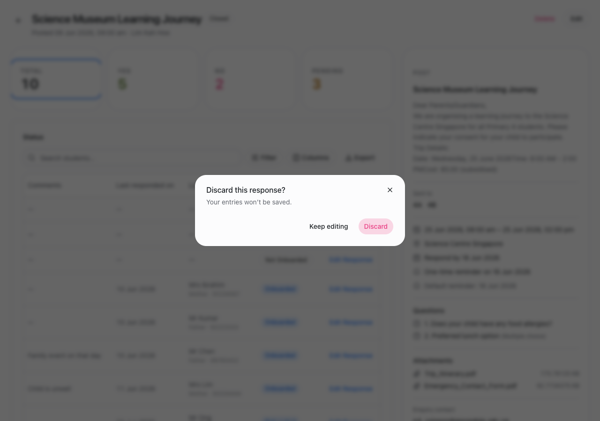

4. **CMP-8 wasn't in Run A's spec at all.** Its `EditResponseDialog` plan documents Yes/No
   validation and async states but never asks "what happens if the teacher hits Esc or
   clicks outside mid-edit?" — the answer, unaddressed, is silent data loss. Run B's Phase 3
   plan named this control explicitly and built a discard-confirm for it (which then needed
   its own bug fix per point 3). Whether this is "the harness caught something" or "this run
   happened to think of it" is worth being honest about — but the harness's control catalog
   is what put CMP-8 in the plan's control list in the first place.
5. **The grill turned an implicit assumption into an explicit, recorded decision.** Editing a
   parent's response on their behalf overwrites a real answer — is that "destructive" under
   CMP-2 (consequence + undo/confirm, non-waivable)? Run B's grill put this to the builder
   rather than picking silently; the answer (yes) produced a plain-language consequence line
   rendered above the submit button, visible here alongside the AC-9 validation state it
   shares a screenshot with:

   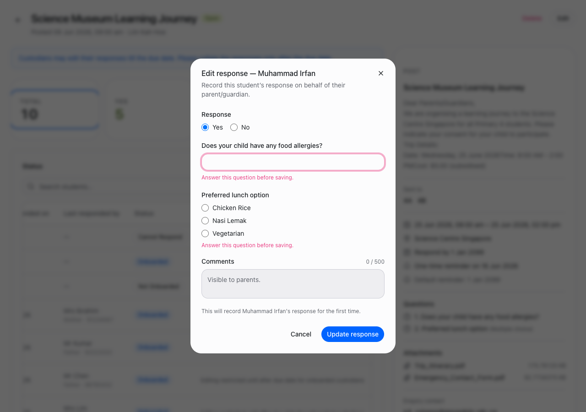

6. **A finding from evaluator pass 2 was closed, not just logged.** The response column
   Run B renamed from "Status" to "Response" (matching the AC's own column naming) left the
   filter popover's matching section still saying "Status" — two sections in one popover
   both labelled "Status," now reading differently for the same field the table calls
   something else. Closed by relabelling the filter section (and the matching PG-status
   section, to "Onboarding") to match:

   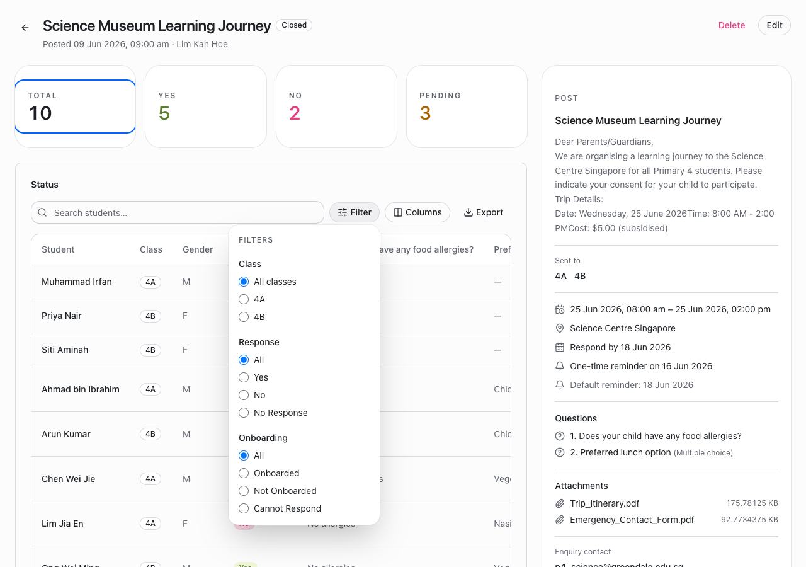

7. **Run B is responsive at mobile width; Run A is not — and the root cause is the exact
   defect Run B's verify phase caught and fixed.** Both implementations share the same
   `
` grid-item wrapper around the table in
   `PostDetailPage.tsx`'s `ConsentFormDetail`. CSS Grid items default to `min-width: auto`,
   so without an explicit `min-w-0` the wrapper refuses to shrink below the table's
   intrinsic content width — at a 360px viewport, that drags the _entire page_, not just
   the table, out to the table's full width. Run B's Phase 5 verify pass caught this at
   360px (`document.body.scrollWidth` was ~2006px against a 360px viewport) and added
   `min-w-0` to the wrapper. Run A never added it. Reproduced directly, same fixture, same
   viewport, same moment in time:

   | Run A — 360px viewport, page renders at 1710px (4.75×)                                                                                | Run B — 360px viewport, page renders at 396px (1.1×, a separate documented minor gap)                                                                         |
   | ------------------------------------------------------------------------------------------------------------------------------------- | ------------------------------------------------------------------------------------------------------------------------------------------------------------- |
   | 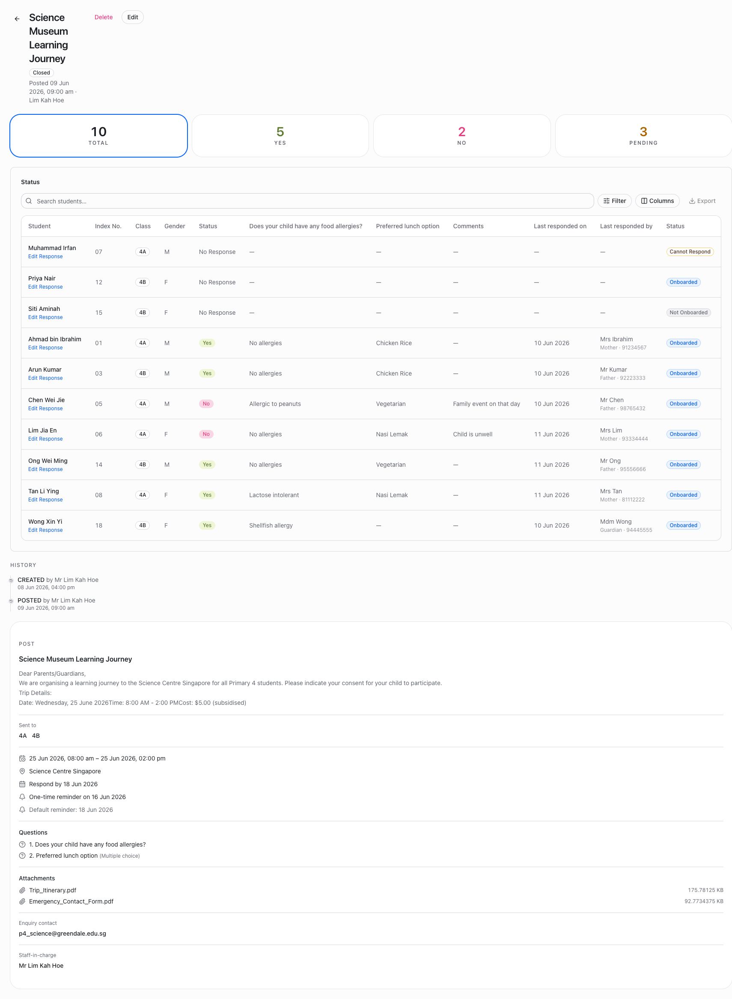 | 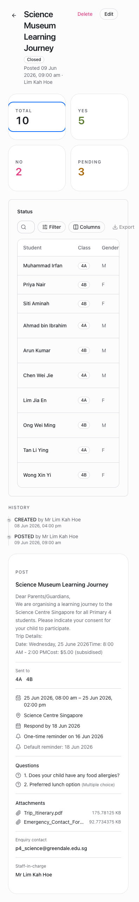 |

   This is an LAY-2 (reflow at 320–360px, WCAG 2.2 SC 1.4.10, **L1**) failure in Run A,
   shipped and unflagged — the same tier of defect Run B's evaluator pass 1 blocked on for
   a different control (A11Y-3). Worth being precise about why Run B caught this one and
   Run A didn't: it isn't that Run B's evaluator is smarter — it's that Run B's Phase 5
   procedure requires capturing and reading a 360px screenshot as a mandatory evidence step,
   and Run A's decision log shows no 360px (or any narrow-viewport) capture at all. The gap
   is procedural (a required evidence step either ran or didn't), not a difference in
   underlying model judgment.

8. **The "Edit Response" trigger is a dedicated action column in Run B; Run A embeds it
   inside the student-name cell.** Confirmed directly in Run A's code
   (`RecipientReadTable.tsx`): the link (or the restriction text) is nested inside the same
   `<TableCell>` as `recipient.studentName`, stacked underneath the name via a `flex-col`
   wrapper — there is no separate action column at all. Scrolling Run A's table all the way
   right lands on the PG-status "Status" column with nothing after it; the only way to reach
   "Edit Response" is to scroll back to the name column, which is exactly where the
   decision-relevant "Status" (onboarded / cannot-respond) info is _not_ visible:

   | Run A: action lives under the name (left edge)...                                                    | ...and the far-right column is the last one — nothing to act on there                                                                     |
   | ---------------------------------------------------------------------------------------------------- | ----------------------------------------------------------------------------------------------------------------------------------------- |
   | 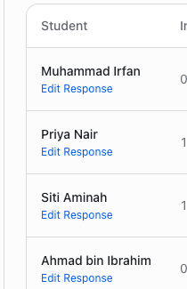 | 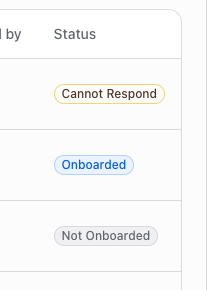 |

   | Run B: name column stays clean...                                                                      | ...and a dedicated action column sits beside Status                                                              |
   | ------------------------------------------------------------------------------------------------------ | ---------------------------------------------------------------------------------------------------------------- |
   | 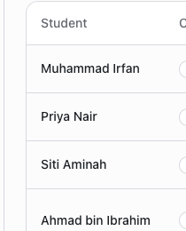 | 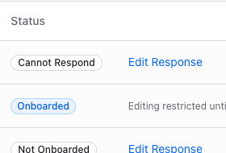 |

   A teacher deciding whether to edit a response needs the PG-status ("Cannot Respond" /
   "Onboarded" / restricted-until-due-date) right next to the action — Run B's layout
   co-locates them; Run A's requires scrolling back and forth between the name column and
   the status column to do the same task. This is a real CMP-6/craft difference, not just
   taste.

   **A provenance note, not a retraction:** when this entry was first drafted, checking it
   against the decision record and against this session's remaining visible context found
   no explicit moment where the trigger's placement was recommended as a considered choice
   — so the first draft recorded it as a structural outcome difference only, not a live
   recommendation. The user, present for the entire session, recalls distinctly that this
   _was_ recommended during the plan/grill phase — a dedicated action column over the
   row/name-embedded pattern. This session ran long (six phases, two evaluator sub-agent
   spawns, extensive verify work); a compaction event earlier in the conversation plausibly
   summarized that exchange out of what remains available to re-check. The user's firsthand
   account is the more complete record here, not the reconstructed one — recorded
   accordingly: Run B's process did recommend the dedicated action column during planning;
   the specific wording isn't independently re-verifiable from what's left in context, and
   that limitation is the reason, not a reason to doubt the recollection itself.

## Misses: what two evaluator passes didn't catch

Efficacy cuts both ways — it's just as important to record what the process missed as what
it caught. One concrete miss, found after both evaluator passes and after this report's
first draft, by the user reviewing the shipped screenshots directly:

- **Stat-tile focus ring sits inside the card, not around it (`ReadTrackingCards.tsx`,
  `StatTile`).** The `<Card>` primitive bakes in its own `py-6` padding and `rounded-3xl`
  corner radius; `StatTile` zeroes `CardContent`'s padding (`className="p-0"`) but never
  touches `Card`'s own `py-6`, and the inner `<button>` carrying the focus/active ring uses
  a smaller `rounded-xl`. Net effect: the button — and therefore its `ring-2` — is a smaller
  rectangle floating inside the card shell rather than matching its edge, most visible top
  and bottom. This is a real CMP-7 (shared resting affordance) / craft defect, not a
  screenshot-only artifact — it's live in the shipped code.

  | Run B — ring inset from the card edge (the bug)                                      | Run A — ring flush with the card edge                                                 |
  | ------------------------------------------------------------------------------------ | ------------------------------------------------------------------------------------- |
  | 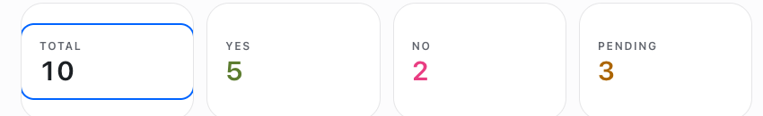 | 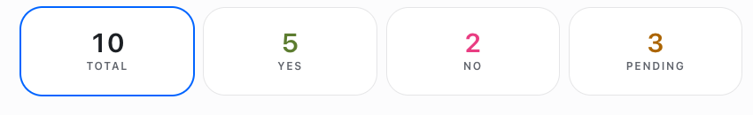 |

- **It was sitting in evidence both evaluator passes were handed and neither flagged it.**
  `1280-open-default.png` — captured before the first evaluator pass and re-used, unchanged,
  through the second — shows the "Total" tile in its default-active state with the ring
  visibly inset from the card's rounded corner. Both passes graded A11Y-8 (state-tracking)
  as a pass because the ring _does_ correctly track `aria-pressed`; neither pass's CMP-7 or
  craft grading caught that the ring's _geometry_ doesn't match its container. That's a real
  gap in what "read the screenshot" caught versus what a human glancing at the same image
  caught in seconds.
- **Why this plausibly slipped through:** the evaluator procedure's CMP-7 guidance is
  worded around component _defaults_ and _cross-page_ consistency ("does this component
  match its sibling usage elsewhere") — it doesn't explicitly prompt for _self-consistency_
  between a component and its own child's box model. A geometry mismatch between a
  container and the interactive element it wraps isn't a category the procedure names, so
  there was nothing steering either pass to look for it specifically.
- **This was not a shared blind spot — Run A's independent implementation avoided it
  entirely.** Run A's own `StatTile` (`ReadTrackingCards.tsx` on
  `design/consent-form-responses-edit-on-behalf`) does three things differently, together:
  the active ring (`ring-2 ring-primary`) is applied to the `<Card>` itself, not an inner
  child; `Card` is given `className="p-0"` directly, zeroing the Card's _own_ padding rather
  than a nested wrapper's; and the button inside uses `rounded-3xl`, matching the Card's own
  corner radius, instead of a smaller one. The ring traces the card's true edge with no gap
  and no radius mismatch. This wasn't luck — it's a coherent, different structural choice
  (ring on the container, not the control) that happens to sidestep the box-model trap Run
  B fell into. That makes this a genuine Run-B-specific miss, not evidence the harness or
  the underlying model can't get this right — one independent attempt at the same component
  got it right the first time.

This isn't fixed as of this report — recording it here as an efficacy data point, per the
user's request, rather than as a resolved item.

## Where the process showed real friction

1. **The plugin wasn't actually installed.** The skill files under `.claude/skills/design/`,
   `.claude/checks/`, `.claude/standards/`, `.claude/agents/` were copied from another repo
   for testing, not installed via `/plugin marketplace add` + `/plugin install`. This meant
   the `Skill` tool couldn't invoke them by name (`Unknown skill: setup`, etc.) — every
   skill had to be hand-read as a markdown file and followed manually. The harness's actual
   mechanics (structured skill invocation, not a human reading procedure docs) were
   untested by this session; only its _content_ was exercised.
2. **The `evaluator` subagent type wasn't registered at session start.** The harness's own
   Phase 5 instructions assume `evaluator` is spawnable like any named agent type. It
   wasn't, until partway through this session (after an unrelated system update) — the
   first evaluator pass had to be worked around by spawning a `general-purpose` agent and
   pasting the entire `evaluator.md` procedure into its prompt by hand. This produced a
   usable verdict, but it's not the intended mechanism, and it cost a large, manually-copied
   prompt to get there.
3. **The first evaluator run hit a session/API rate limit mid-task and had to be resumed**
   via a follow-up message to the same agent instance. It picked back up from its own
   transcript and finished, but this is a real reliability gap for a verify step the harness
   treats as load-bearing ("never write the verdict yourself, and never present unverified
   work as verified while waiting").
4. **The verify phase's E2E run was noisy from unrelated infrastructure.** Both runs
   independently documented the same 13-failed/8-not-run baseline on unmodified spec files —
   a dev-server/Module-Federation cold-start race, not a design defect. Two independent
   sessions burning time confirming the same pre-existing noise isn't a design-harness
   problem exactly, but it's real cost the verify phase pays every time it runs the full
   suite as instructed, and neither run's decision record proposes fixing the underlying
   flake (both correctly scoped it as out-of-bounds, but "correctly declining to fix it"
   still cost a round of investigation each time).
5. **Screenshot/evidence capture required real workarounds, not a clean path.** Capturing
   the "open" (before-due-date) state needed a temporary fixture date bump (all mock due
   dates were in the past relative to the real system clock); capturing the loading and
   error async states needed temporary artificial delay/fault injection into the mock
   handler, both reverted after capture. The harness's verify.md anticipates this in spirit
   ("build a clearly-marked demo-only hook where needed... a state that can't be
   demonstrated can't be verified") but doesn't have a lighter mechanism for it than manual
   temporary source edits.
6. **Two evaluator rounds is not obviously the efficient stopping point.** After the second
   pass (pass-with-findings, zero BLOCKING), one more small fix was applied and verified
   directly rather than via a third full evaluator round — a judgment call to avoid
   diminishing-returns re-grading, but the harness gives no explicit guidance on when a
   re-verify needs the full evaluator versus a lighter direct check.

## Consistency signal worth noting

Despite zero shared context, both runs independently chose: the same 4-tile stat-card
replacement (not a redesign), the same "no new tabs" structural call, the same
`'cannot-respond'`-as-an-assumed-enum-value tradeoff with the same honest caveat about
backend grooming, the same reuse of the `role="alert"` validation-error convention from
`CreatePostPage`, and the same E2E scenario-to-test breakdown (12 scenarios, the due-date
one doubled). For a process meant to be repeatable rather than a one-off creative exercise,
that's a good sign — the harness's controls and "reuse existing patterns" defaults appear to
be doing real convergence work, not just producing plausible-sounding but divergent designs
each time.

## Recommendations

1. **Adoption call, the user's own verdict on this session, stated directly: a large ticket
   like this one should not be recommended for an engineer to take on without designer
   input.** This issue — 12 AC scenarios, a new interaction pattern, a multi-hour build —
   was exactly that kind of ticket, run solo end to end without a designer in the loop. Two
   compounding reasons, both borne out directly by this run rather than asserted in the
   abstract:
   - **The loop still leaves a large share of genuine design judgment to whoever is
     running it, not to a trained designer.** The grill does surface real decisions (CMP-2
     destructive-or-not, the scope-dimension/ambition question, reviewer-routing) — but of
     the five `AskUserQuestion` gates in this session, three were resolved by accepting the
     option marked "(Recommended)" outright (scope dimension, who-implements, final plan
     approval), one was clarified rather than substantively redirected (reviewer-routing),
     and only one was genuinely overridden (CMP-2). That pattern is equally consistent with
     careful agreement _or_ with an engineer clicking through gates they aren't
     well-positioned to evaluate on design merit — the harness has no way to tell the two
     apart, and on a change this size, that ambiguity is a real risk, not a nitpick.
   - **The loop still doesn't cover a lot of what a professional designer's actual flow
     covers.** This report's own findings are the evidence: a focus-ring/card box-model
     mismatch neither evaluator pass caught (Misses); the Edit-Response action-column
     placement, which needed a live, explicit recommendation to land correctly rather than
     the loop surfacing it unprompted (point 8 above); and several UNCOVERED items (the
     acknowledge-forms label collision, the CMP-7 mixed-badge inconsistency, the
     TYP-4-vs-consistency tension) a designer's eye would plausibly have caught faster than
     a control catalog and two grading passes did.
   - It is also genuinely expensive for what it produced: on the order of hours end to end
     for one feature (see the Runtime row, with the same measurement caveat noted there),
     on top of the Friction items below.
   - **Recommended path forward, stated directly:** try this skill next on an issue with
     more modest, lower-ambiguity design needs before trusting it with another large
     feature. And, more importantly, **there is a need at the create-issue phase to
     evaluate whether a given issue can or cannot be taken up by an engineer without design
     input** — an explicit go/no-go decision made when the issue is created or groomed (the
     `create-issue` skill in this same harness family is the natural place for it), not
     discovered mid-loop after structure is already committed. Today the closest thing to
     this is the reviewer-routing table, and it runs at the wrong time for this purpose: it
     flags a scenario as needing a designer's review only in Phase 3, after Intent and
     Diverge have already happened without one. A large ticket like this one should be
     routed to a designer — or flagged as needing one — before an engineer starts the loop
     at all, not after.
2. Actually install the `dx-harness` plugin properly
   ([transformteamsg/dx-harness](https://github.com/transformteamsg/dx-harness) — renamed
   from `atelier` since this session ran) via `/plugin marketplace add` + `/plugin install`
   rather than continuing to run off copied files — this session's findings about skill
   _content_ are solid, but its findings about skill _mechanics_
   (invocation, agent registration) are confounded by the plugin not being installed.
3. Fix the evaluator-agent registration gap so Phase 5 doesn't depend on a manual
   procedure-paste workaround.
4. Consider a documented policy for evaluator-loop resumption after an interruption
   (session limit, rate limit) — this worked via ad hoc `SendMessage` resumption, but that's
   an operator workaround, not a designed path.
5. Consider whether the verify phase needs a lighter-weight "did the fix work" recheck
   distinct from a full evaluator re-grade, for the common case of a small, targeted
   post-verdict fix.
6. File the pre-existing E2E baseline flake (found and documented independently by both
   runs) and the three now-fixed pre-existing L0/L1 violations (missing search-input
   label, off-scale filter badge, missing `min-w-0` reflow guard — found only by Run B's
   process, shipped unflagged in Run A) as their own follow-up issues. Both are real,
   pre-existing gaps neither run's scope covered fixing at the root — Run A's copy of the
   `min-w-0` gap in its own untouched `AnnouncementDetail` sibling is presumably still
   there too.

## Sources

- Run A: [`design-spec.md`](https://github.com/String-dxd/teacher-workspace-pg-frontend/blob/design/consent-form-responses-edit-on-behalf/design-spec.md) on `design/consent-form-responses-edit-on-behalf`, PR #110
- Run B: [`docs/decisions/consent-form-responses.md`](../decisions/consent-form-responses.md), PR #117
- Human critique pass: comments on PR #110 by a repo member using `tfx:critique` + manual review
