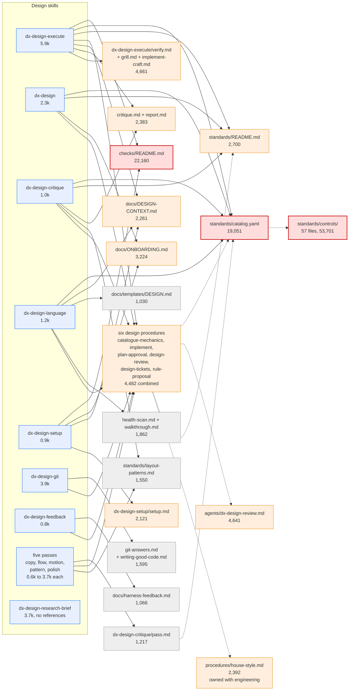

# Design skill token budget

This document maps the 13 `dx-design-*` skills to the files they read and counts the
tokens in each. For the method, the shared files, and the engineering figures, see
[Skill token budget](token-budget.md).

A design run reads 3,667 to 83,037 tokens before the agent looks at a single product file.
The mean is 40,983. The cluster owns 34 reference files holding 85,524 tokens.

## Cost per skill

| Skill | `SKILL.md` | Depth 1 | Depth 2 | Per run | Files read | Worst case |
| --- | --: | --: | --: | --: | --: | --: |
| `dx-design-execute` | 5,903 | 58,685 | 18,449 | **83,037** | 27 | 136,738 |
| `dx-design` | 2,283 | 29,949 | 36,739 | **68,971** | 19 | 122,672 |
| `dx-design-setup` | 858 | 29,766 | 30,680 | **61,304** | 13 | 115,005 |
| `dx-design-copy` | 3,728 | 8,216 | 32,119 | **44,063** | 16 | 97,764 |
| `dx-design-pattern` | 1,082 | 7,249 | 32,119 | **40,450** | 15 | 94,151 |
| `dx-design-polish` | 687 | 6,373 | 32,119 | **39,179** | 15 | 92,880 |
| `dx-design-motion` | 613 | 6,373 | 32,119 | **39,105** | 15 | 92,806 |
| `dx-design-language` | 1,231 | 26,030 | 11,679 | **38,940** | 13 | 92,641 |
| `dx-design-critique` | 1,043 | 27,128 | 10,416 | **38,587** | 12 | 92,288 |
| `dx-design-flow` | 653 | 5,699 | 32,119 | **38,471** | 14 | 92,172 |
| `dx-design-git` | 3,884 | 2,606 | 22,388 | **28,878** | 8 | 82,579 |
| `dx-design-feedback` | 773 | 1,448 | 5,908 | **8,129** | 5 | as per run |
| `dx-design-research-brief` | 3,667 | 0 | 0 | **3,667** | 0 | as per run |

`dx-design-execute` makes 27 sequential reads. `dx-design-research-brief` makes none.

## High-usage documents

| Document | Tokens | Skills | Load | Read at |
| --- | --: | --: | --: | --- |
| `standards/catalog.yaml` | 19,051 | 11 | 209,561 | Depth 1 from 4, depth 2 from 7 |
| `checks/README.md` | 22,160 | 3 | 66,480 | Depth 1 from 2, depth 2 from 1 |
| `agents/dx-design-review.md` | 4,641 | 9 | 41,769 | Depth 2 from 9 |
| `standards/README.md` | 2,700 | 11 | 29,700 | Depth 1 from 3, depth 2 from 8 |
| `procedures/house-style.md` | 2,392 | 10 | 23,920 | Depth 2 from 10 |
| `procedures/catalogue-mechanics.md` | 816 | 12 | 9,792 | Depth 1 from 9, depth 2 from 3 |
| `standards/controls/cmp-1.md` | 1,208 | 8 | 9,664 | Depth 1 from 1, depth 2 from 7 |
| `docs/harness-feedback.md` | 1,066 | 9 | 9,594 | Depth 1 from 1, depth 2 from 8 |
| `docs/DESIGN-CONTEXT.md` | 2,261 | 4 | 9,044 | Depth 1 from 3, depth 2 from 1 |
| `procedures/implement.md` | 1,011 | 8 | 8,088 | Depth 1 from 8 |
| `skills/design/dx-design-critique/critique.md` | 1,061 | 7 | 7,427 | Depth 1 from 2, depth 2 from 5 |
| `procedures/design-tickets.md` | 628 | 11 | 6,908 | Depth 1 from 9, depth 2 from 2 |
| `procedures/plan-approval.md` | 960 | 7 | 6,720 | Depth 1 from 7 |
| `docs/ONBOARDING.md` | 3,224 | 2 | 6,448 | Depth 1 from 2 |
| `skills/design/dx-design-setup/setup.md` | 2,121 | 3 | 6,363 | Depth 1 from 1, depth 2 from 2 |
| `skills/design/dx-design-critique/pass.md` | 1,217 | 5 | 6,085 | Depth 1 from 5 |
| `procedures/design-review.md` | 685 | 8 | 5,480 | Depth 1 from 7, depth 2 from 1 |
| `skills/design/dx-design-execute/verify.md` | 2,562 | 2 | 5,124 | Depth 1 from 1, depth 2 from 1 |
| `standards/controls/slp-9.md` | 1,637 | 3 | 4,911 | Depth 1 from 1, depth 2 from 2 |
| `standards/layout-patterns.md` | 1,550 | 3 | 4,650 | Depth 1 from 2, depth 2 from 1 |
| `standards/controls/idn-3.md` | 880 | 5 | 4,400 | Depth 1 from 1, depth 2 from 4 |
| `docs/templates/DESIGN.md` | 1,030 | 4 | 4,120 | Depth 1 from 1, depth 2 from 3 |
| `procedures/rule-proposal.md` | 382 | 10 | 3,820 | Depth 1 from 9, depth 2 from 1 |
| `docs/decisions/TEMPLATE.md` | 1,101 | 3 | 3,303 | Depth 1 from 1, depth 2 from 2 |

## Map

The map shows the design skills and the documents they read. Skills with an identical
reference set share a node. The colour marks a document's size: red is 10,000 tokens or
more, amber is 2,000 to 9,999, and grey is under 2,000. A dashed edge is a depth 2 reach.

## Where the cost concentrates

**Two documents and the control details hold most of the cluster's weight**.
`standards/catalog.yaml` (19,051), `checks/README.md` (22,160), and the 57 control detail
files (53,701) total 94,912 tokens. Every other design file is small by comparison.

**`checks/README.md` is the largest single mandatory read**. It holds 22,160 tokens over
940 lines, more than the catalogue. Two skills read it: `dx-design-execute` before the
verify phase, and `dx-design-setup` for the honesty rule. Both need one thing from it:
which control each script covers and what it misses. The rest is implementation detail:
the `checklib.py` scaffolding, the ast-grep front end, and the per-script internals.

**The catalogue loads whole and then fans out**. No skill reads a slice. Four skills read
all 19,051 tokens at depth 1, and `pass.md` and `procedures/implement.md` pull it in for
the rest. The `detail` rule then adds up to 53,701 more. A pass that judges one dimension
pays for the whole catalogue.

**Small files drive the read count, not the token count**. The five passes each read six
design procedure files that total 4,482 tokens. The tokens are cheap. Six sequential reads
are not.

**Two skills are far cheaper than the rest**. `dx-design-feedback` runs at 8,129 tokens
and `dx-design-research-brief` at 3,667. Neither touches the catalogue. They show that the
cost sits in the standards path, not in the design skills as such.

## What to change

The list is ordered by saving per unit of work.

1. **Split `checks/README.md`**. Move the coverage table into a short file that names each
   script, its controls, and its gaps. Point `dx-design-execute` and `dx-design-setup` at
   that file. Keep the internals where a maintainer finds them. Expected saving is about
   20,000 tokens per design build and per setup run.
2. **Ship a filtered projection of the catalogue**. The skills already filter controls by
   `phase` and scope after loading everything. Generate one file per phase, or let the
   agent query the catalogue through a script. Expected saving is 10,000 to 15,000 tokens
   for every pass and critique run.
3. **Inline the `detail` files of the controls that every run applies**. The L0 floor and
   `CMP-1` appear in most runs. Put their normative text in the catalogue entry. Reserve a
   separate `detail` file for the controls that need long worked examples.
4. **Merge the six design procedure files into one**. `catalogue-mechanics.md`,
   `implement.md`, `plan-approval.md`, `design-review.md`, `design-tickets.md`, and
   `rule-proposal.md` total 4,482 tokens and nine skills read the same set. One file cuts
   six reads to one and removes the depth 2 chain into `agents/dx-design-review.md`.
5. **Name the branch that needs `agents/dx-design-review.md`**. Nine skills reach its
   4,641 tokens at depth 2, through `procedures/catalogue-mechanics.md`. Only the verify
   phase spawns the reviewer. Carry the file on the verify path alone.
6. **Re-measure after each change**. Rebuild this table before you trim anything else.
   The ranking, not the absolute figure, tells you where to work.

## Shared with the engineering team

Ten design skills reach `procedures/house-style.md` (2,392) at depth 2, through
`procedures/design-tickets.md`. The engineering team owns that file, and nine of their
skills read it at depth 1. Raise any change to it with them.

That team has now cut it to 1,704 tokens and deleted
`procedures/house-style-mechanics.md` and `scripts/house-style-lint.py`, on a measured
lint yield of about one unambiguous finding per artifact. See
[the engineering document](token-budget-engineering.md). The design cluster never read
the mechanics file, so it gains 688 tokens on each of the 10 paths that reach the
parent.

`skills/design/dx-design/issue-intake.md` (2,203) sits in this cluster's directory, but
`dx-create-story` and `dx-create-task` read it at depth 1. Treat it as shared.
