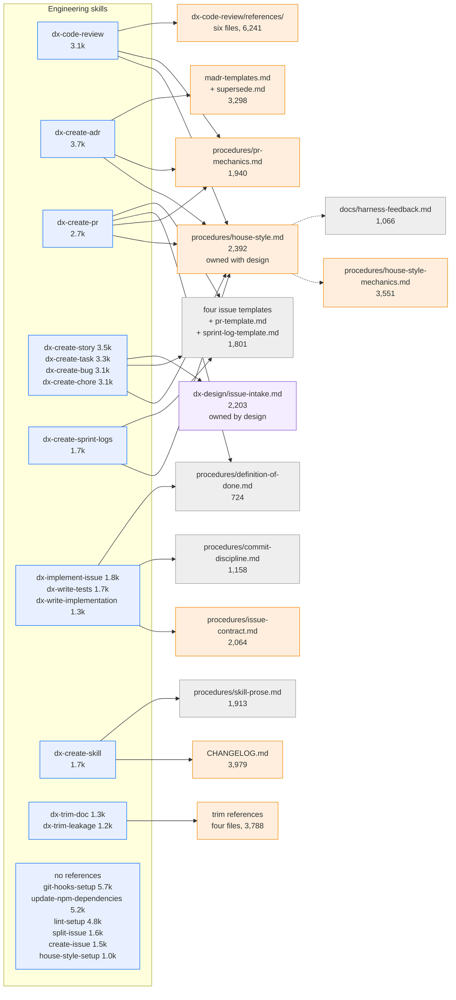

# Engineering skill token budget

This document maps the 20 engineering skills to the files they read and counts the tokens
in each. For the method, the shared files, and the design figures, see
[Skill token budget](token-budget.md).

An engineering run reads 978 to 21,547 tokens. The mean is 8,570. The cluster owns 33
reference files holding 41,552 tokens, and its `SKILL.md` bodies total 52,850.

The weight sits in the skill bodies, not the references. Six skills carry no references at
all. That shape keeps a run cheap, and it also means a trigger that needs one section
still loads the whole file.

## Cost per skill

| Skill | `SKILL.md` | Depth 1 | Depth 2 | Per run | Files read | Worst case |
| --- | --: | --: | --: | --: | --: | --: |
| `dx-code-review` | 3,135 | 10,573 | 7,839 | **21,547** | 12 | as per run |
| `dx-create-adr` | 3,693 | 7,630 | 4,617 | **15,940** | 6 | as per run |
| `dx-create-skill` | 1,719 | 5,892 | 7,014 | **14,625** | 7 | as per run |
| `dx-create-pr` | 2,731 | 5,214 | 5,775 | **13,720** | 7 | as per run |
| `dx-create-story` | 3,492 | 5,124 | 4,898 | **13,514** | 7 | as per run |
| `dx-create-task` | 3,287 | 4,876 | 4,962 | **13,125** | 6 | as per run |
| `dx-create-bug` | 3,060 | 2,648 | 4,617 | **10,325** | 4 | as per run |
| `dx-create-chore` | 3,070 | 2,504 | 4,617 | **10,191** | 4 | as per run |
| `dx-create-sprint-logs` | 1,702 | 3,117 | 4,617 | **9,436** | 4 | as per run |
| `dx-write-tests` | 1,666 | 3,222 | 2,837 | **7,725** | 4 | as per run |
| `dx-write-implementation` | 1,342 | 3,222 | 2,837 | **7,401** | 4 | as per run |
| `dx-implement-issue` | 1,844 | 2,788 | 2,055 | **6,687** | 4 | as per run |
| `dx-git-hooks-setup` | 5,652 | 0 | 0 | **5,652** | 0 | as per run |
| `dx-update-npm-dependencies` | 5,221 | 0 | 0 | **5,221** | 0 | as per run |
| `dx-trim-doc` | 1,281 | 1,799 | 1,989 | **5,069** | 4 | as per run |
| `dx-lint-setup` | 4,755 | 0 | 0 | **4,755** | 0 | as per run |
| `dx-trim-leakage` | 1,198 | 1,276 | 0 | **2,474** | 1 | as per run |
| `dx-split-issue` | 1,572 | 0 | 0 | **1,572** | 0 | as per run |
| `dx-create-issue` | 1,452 | 0 | 0 | **1,452** | 0 | as per run |
| `dx-house-style-setup` | 978 | 0 | 0 | **978** | 0 | as per run |

No engineering skill loads `standards/catalog.yaml`, so the worst case equals the per-run
figure throughout.

## High-usage documents

| Document | Tokens | Skills | Load | Read at |
| --- | --: | --: | --: | --- |
| `procedures/house-style-mechanics.md` | 3,551 | 8 | 28,408 | Depth 2 from 8 |
| `procedures/house-style.md` | 2,392 | 9 | 21,528 | Depth 1 from 8, depth 2 from 1 |
| `procedures/pr-mechanics.md` | 1,940 | 5 | 9,700 | Depth 1 from 3, depth 2 from 2 |
| `docs/harness-feedback.md` | 1,066 | 8 | 8,528 | Depth 2 from 8 |
| `procedures/issue-contract.md` | 2,064 | 4 | 8,256 | Depth 1 from 3, depth 2 from 1 |
| `procedures/commit-discipline.md` | 1,158 | 5 | 5,790 | Depth 1 from 2, depth 2 from 3 |
| `skills/design/dx-design/issue-intake.md` | 2,203 | 2 | 4,406 | Depth 1 from 2 |
| `CHANGELOG.md` | 3,979 | 1 | 3,979 | Depth 1 from 1 |
| `skills/engineering/dx-code-review/references/agent-pattern-standard.md` | 897 | 4 | 3,588 | Depth 1 from 1, depth 2 from 3 |

## Map

The map shows the engineering skills and the documents they read. Skills with an identical
reference set share a node. The colour marks a document's size: amber is 2,000 tokens or
more and grey is under 2,000. No engineering document reaches 10,000. A dashed edge is a
depth 2 reach.

## Where the cost concentrates

**The house-style chain is the one hub**. Eight authoring skills read
`procedures/house-style.md` (2,392) at depth 1, and it reaches
`procedures/house-style-mechanics.md` (3,551) and `docs/harness-feedback.md` (1,066) at
depth 2. The mechanics file carries the highest load in the cluster at 28,408.

**Over half the mechanics file is lint data**. Its four word-list tables hold 1,918 tokens
and supply 80 of the lint's 101 rules, which `load_lists()` parses at run time. The file
tells the agent to run the lint rather than read those tables, but an agent that opens the
file loads them anyway. The next section measures what those rules return.

**`dx-create-skill` reads the whole changelog**. `CHANGELOG.md` is 3,979 tokens at depth 1
and it grows with every release. It is the only unbounded reference in the cluster.

**Six skills carry everything in the body**. `dx-git-hooks-setup` (5,652),
`dx-update-npm-dependencies` (5,221), `dx-lint-setup` (4,755), `dx-split-issue` (1,572),
`dx-create-issue` (1,452), and `dx-house-style-setup` (978) read no references. The three
large ones branch by tool inside one file, so a Husky run loads the Lefthook text too.

**The four issue skills duplicate their intake**. `dx-create-story` (3,492),
`dx-create-task` (3,287), `dx-create-bug` (3,060), and `dx-create-chore` (3,070) carry
similar bodies. Each then reads `house-style.md` and one small template.

**This cluster is not the source of the complaint**. The dearest engineering run,
`dx-code-review` at 21,547 tokens, costs less than a quarter of the dearest design run.
Twelve of the 20 skills run under 10,000 tokens.

## What the lint returned

This section records the measurement that items 1 and 2 acted on. The lint and the
mechanics file are deleted, so the figures here are a record, not a live reading.

`scripts/house-style-lint.py` was the reason the mechanics file carried 1,918 tokens of
tables. Run against 16 merged artifacts from the harness repository, it returned this:

| Artifact set | Findings |
| --- | --: |
| Eight issue bodies | 0 |
| Eight pull request bodies | 56 |

Of the 56 findings:

- **27, or 48 per cent, come from one broken rule.** The `N/N` fraction check fires on
  eval score cells in tables: `5/5`, `4/4`, `4-5/5`. Every hit is wrong. The rule was
  written for a fraction in prose.
- **13 are WARNs whose own message defers to context**, such as "fine after the first use".
- **About 16 are unambiguous**, roughly one per artifact. Most are `since` where `because`
  is meant, plus sentences over the 25-word cap.

The four issue skills are half the authoring set, and the lint returns nothing on their
output. On the issues alone, that reading supports the standard rather than the lint. The
pull requests separate the two. `house-style.md` tells a skill to run the lint before it
posts. Yet 56 findings reached a merge, so the gate is not gating.

Two limits on this measurement. Sixteen artifacts is a small sample, taken from the most
recent merges rather than at random. The 48 per cent figure comes from a single rule, so a
sample without score tables would shift it a long way.

## What to change

The list is ordered by saving per unit of work. Items 1 to 3 are [#379](https://github.com/transformteamsg/dx-harness/issues/379), item 4 is [#346](https://github.com/transformteamsg/dx-harness/issues/346), and item 5 is [#380](https://github.com/transformteamsg/dx-harness/issues/380).

1. **Delete the lint and `house-style-mechanics.md`**. Done. The tables existed to feed
   the lint, and the lint returned about one unambiguous finding per artifact. Both files
   already told the agent not to read the tables. Removing the pair takes 3,551 tokens out
   of the chain and drops the cluster's highest load, 28,408, to nothing.
2. **Rewrite `house-style.md` as one file**. Done, at 1,704 tokens rather than the 1,000
   this list first projected. It keeps three sections that no checker and no specification
   name can reach: the cut tests before posting, the test for length, and the evidence bar
   on a claim. Google's mechanics now come from `CLAUDE.md`, which already covers these
   artifacts. The sentence-length caps are gone, and so is the path to
   `docs/harness-feedback.md`. Measured saving on the parent file is 688 tokens.

   The 1,000-token projection added three section sizes and ignored the header, the scope
   list, and the connective prose. Cutting to 1,000 would have meant dropping a section
   the measurement said to keep.
3. **Stop `dx-create-skill` reading the whole changelog**. Done. Step 8 now reads the
   `Unreleased` section through `sed` rather than opening the file. That section holds 930
   tokens against the file's 3,979, so the measured saving is 3,049 tokens. The read no
   longer grows with each release.
4. **Split the three large tool-branching skills**. Move the per-tool sections of
   `dx-git-hooks-setup`, `dx-update-npm-dependencies`, and `dx-lint-setup` into references.
   A run then loads the branch it chose. Expected saving is 2,000 to 4,000 tokens per run.
   All three read no references, so the whole `SKILL.md` loads on every trigger. #346
   already tracks them by word count, and carries these token figures as a comment.
5. **Extract the reviewer-routing table into a procedure**. Done. `dx-create-story` and
   `dx-create-task` read all 2,203 tokens of `skills/design/dx-design/issue-intake.md` to
   reach one routing table. Both now read `procedures/reviewer-routing.md` at 412 tokens,
   saving 1,791 per run, and no engineering skill reads a file under `skills/design/`.
   `dx-design` reads both files and pays 182 tokens for the deduplication.
6. **Re-measure after each change**. Rebuild this table before you trim anything else.
   The ranking, not the absolute figure, tells you where to work.

Items 1 and 2 are one decision. Inlining the surviving rules into each of the eight
authoring skills was considered and rejected. At about 900 tokens a copy, it saves roughly
100 tokens per run over one shared file. It also leaves eight copies to drift, with no
lint left to catch them.

## Shared with the design team

`procedures/house-style.md` is read at depth 1 by nine skills here and reached at depth 2
by 10 design skills. Any change to it lands on both teams.

`dx-create-story` and `dx-create-task` no longer read
`skills/design/dx-design/issue-intake.md`. Item 5 above moved the routing table they
needed into `procedures/reviewer-routing.md`, which all three skills read.

Three design-owned files reach this cluster through `dx-create-skill` alone, all at depth
2: `standards/README.md` (2,700), `procedures/catalogue-mechanics.md` (816), and
`procedures/rule-proposal.md` (382). No other engineering skill touches them.

`docs/harness-feedback.md` (1,066) is reached at depth 2 by eight skills here and nine
design skills. Item 2 above removes the path that pulls it in.

## Why not the Concise output style

Claude Code ships a built-in **Concise** output style: 54 tokens, loaded once per session.
The house style costs 2,392 tokens per authoring run, plus 3,551 when the mechanics file
fires. Concise is between 40 and 110 times cheaper, so the token question has one answer.

After items 1 and 2 above, the house style is one file of about 1,000 tokens. Concise is
still not a substitute for it, for two reasons.

**It governs a different artifact.** An output style shapes the replies an agent writes in
the terminal. The house style shapes issue bodies, request descriptions, decision records,
and review comments. Those persist in GitHub and are read later. Concise says to lead with
the result and cut preamble. It says nothing about these rules:

- An empty section takes `None`.
- A superlative needs something that verifies it.
- A security claim reads "helps with", never "prevents".
- Time-anchoring language goes stale, so the artifact gives a date or a version.

Those four rules are the ones that shape an issue body, and they are what items 1 and 2
keep.

**The mechanism has been tried here.** `procedures/house-style.md` records a repository
trial. Appending the house style, or an output-style copy of it, to a skill's system
prompt made output worse. That finding covers the house style's own text, not Concise. It
is evidence against the delivery mechanism rather than against the wording.

The two also optimise for different things. Concise pushes towards a shorter answer. The
house style holds that "a long artifact is not wrong on its own". A change that turns on
20 verified facts needs all 20. For an acceptance criterion or a reproduction step, the
shorter answer is the wrong failure mode.

Where Concise does compete is the session output style, `output-styles/dx-house-style.md`
at 1,269 tokens. That file overlaps Concise heavily. Its unique content is Commonwealth
spelling, Google's mechanics, and the ASD-STE100 sentence rules, which keep terminal prose
and artifact prose consistent. Whether that consistency earns 1,269 tokens in every
session is a fair question, and it is a separate decision from the procedure files.

One argument for the house style did not survive measurement. The case for keeping
`house-style-mechanics.md` was that a deterministic gate beats an instruction. That holds
in principle for text which outlives the session. This gate does not hold at that
standard, so it is no longer a reason to keep the file.
