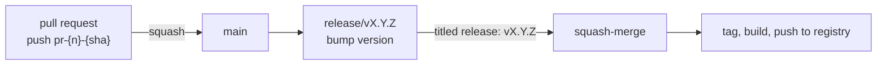

# MADR templates

Two variants of the MADR 4.0.0 template. Step 6 of `SKILL.md` chooses between them
and fills one in. Copy the variant, replace every angle-bracket placeholder, and
delete no headings: a section with nothing to say gets `N/A` and a one-line reason.

The frontmatter below is MADR's, tightened with three fields the Transform house
template (`ADR_TEMPLATE.md` in `transformteamsg/design-documents`) carries and stock
MADR does not: `authors`, `discussed-in`, and `supersedes`. Each closes a gap that
costs a reader something real. The house template writes these as body labels, so
the names here are the frontmatter form of them: its `Author(s)` is `authors`, and
its `Discussion` is `discussed-in`. This skill also makes MADR's own `status` and
`date` required rather than optional.

## Frontmatter

Both variants share this block. MADR treats every field as optional; this skill does
not. `status`, `date`, `authors`, and `discussed-in` are required on every record.

```yaml
---
status: accepted
date: YYYY-MM-DD
authors:                          # who WROTE the record, not who decided
  - Name / [@handle](https://github.com/handle)
decision-makers: <names, or N/A>  # who settled it; often not the authors
discussed-in: <link or sentence>  # RFC, thread, notes, transcript
supersedes: <ADR-NNNN, omitted when this record replaces nothing>
---
```

`authors` and `decision-makers` sit adjacent and sound alike, so fill them
separately. A record is often written up by one person after a group settled it, and
a reader with a question needs the writer rather than the room.

`discussed-in` takes any record of the argument, not only an RFC issue. A Slack or
GitHub thread, meeting notes, a transcript, or a commented doc all qualify. Link
whichever one holds the reasoning.

Fill it even when none of those exists: write what happened instead, such as
`settled in grooming on 2026-09-03; no RFC issue was raised`. Never reach for the
nearest issue to have something to link. A delivery ticket that does not hold the
argument looks like a trail and leads nowhere, which is worse than the plain
sentence.

Where notes or a transcript have no durable link, put them in the record instead.
Use a collapsed `Discussion notes` section, per `## Material no heading covers`.
Set the field to `see Discussion notes`.

### Status values

Exactly these six. Never invent a seventh.

| Status | Means |
| --- | --- |
| `draft` | Still being assembled. Not asking anyone for a decision yet. |
| `proposed` | Complete, and asking for a decision. |
| `accepted` | In force. |
| `rejected` | Considered and turned down, kept so the reasoning is not repeated. |
| `deprecated` | No longer relevant, and not replaced. |
| `superseded by ADR-NNNN` | Replaced, with the replacement named. |

`draft` is not a MADR status. It is here because `proposed` carries a request, and a
record opened to scope a spike is not making one yet. Without the distinction a
reviewer cannot tell whether a record wants their attention.

Ask which one applies rather than defaulting. Guessing `accepted` on a record still
under discussion makes it read as settled to everyone who finds it later.

`accepted` and `Confirmation` answer different questions. `accepted` means the team is
bound by the decision now; `Confirmation` says what would catch a drift from it. Where
nothing does yet, say so in `Confirmation` and stay `accepted`. Where nobody is bound
until a spike or a trial run lands, use `proposed`.

## While the decision is open

A record can be opened before the decision is made, to scope what has to be settled
and to collect what a spike finds. Two things change while its status is `draft` or
`proposed`.

**`Decision Outcome` says what will settle it**, rather than what was settled:

```markdown
## Decision Outcome

Not yet decided. This record scopes the decision.

Settled by: <the spike, benchmark, or data that will choose>
```

**A research log holds what was tried**, as a named collapsed section immediately
before `More Information`, following the same shape as any other unheaded material:

```markdown
<details>
<summary>Research log</summary>

**2026-09-04** <what was tried, what happened, what it rules in or out>

**2026-09-06** <the next entry, appended below the last>

</details>
```

Keep the log when the record is accepted. The paths that failed are the reason it is
worth keeping: they stop the next person spending a week ruling out what you already
ruled out.

## Minimal

Use this when the decision has few options and a rationale that fits in a
paragraph. Most records are this shape.

```markdown
# NNNN Short title naming the decision, not the problem

## Context and Problem Statement

<What forced a decision. Two to four sentences. State the constraint that made the
status quo untenable, so a reader can tell whether it still holds. Name the
requirements it had to meet, and the user journey it touches where it touches one:
Minimal has no Decision Drivers section to hold them.>

## Considered Options

- <Option 1>
- <Option 2>

## Decision Outcome

Chosen option: "<option>", because <the reason that decided it>.

<What follows from this: what becomes easier, what becomes harder, and what a
future change would have to undo.>

## More Information

<Links to the spike, the benchmark, or the issue. Write "N/A" if there is nothing
to point at. The link to where the decision was argued belongs in the `discussed-in`
frontmatter field, not only here.>
```

## Full

Use this when the decision has several options, a migration cost, or consequences
worth separating from the rationale.

```markdown
# NNNN Short title naming the decision, not the problem

## Context and Problem Statement

<What forced a decision, and the constraint that made the status quo untenable.
Name the user journey it touches where it touches one, because that is an input to
the decision rather than a consequence of it. Omit the sentence where no user-facing
surface is involved.>

## Decision Drivers

The requirements the decision had to meet, functional and non-functional. Name the
non-functional ones explicitly: latency, availability, cost, and security are the
drivers most often left implicit and most often decisive.

- <The thing that mattered most>
- <The next thing>

## Considered Options

- <Option 1>
- <Option 2>
- <Option 3>

## Decision Outcome

Chosen option: "<option>", because <the reason that decided it>.

### Consequences

- Good, because <what this makes easier>
- Bad, because <what this makes harder, or what it costs to undo>

### Confirmation

<How anyone checks the decision is actually in force: a test, a lint rule, a
check in CI, or a named review step. Write "N/A" and say why if nothing enforces
it, because an unenforced decision drifts and the record should admit that.>

## Pros and Cons of the Options

### <Option 1>

- Good, because <reason>
- Bad, because <reason>

### <Option 2>

- Good, because <reason>
- Bad, because <reason>

## More Information

<Links to the spike, the benchmark, or the issue. The link to where the decision was
argued belongs in the `discussed-in` frontmatter field, not only here. Write "N/A" if
there is nothing further to point at.>
```

## An optional decision matrix

Four or more options and three or more `Decision Drivers`: add a matrix immediately
before `Decision Outcome`. Options as rows, drivers as columns, cells a few words.

```markdown
| Option | Groups merges | Tag traces to commit | CI cost | Guards production |
| --- | --- | --- | --- | --- |
| Release PR from main | Yes | Yes | Low | Workflow condition |
| Release PR plus RC branch | Yes | Yes | Low | Branch, structural |
| Release on every merge | No | Yes | High | None |
```

It adds to `Consequences` and `Pros and Cons of the Options` and replaces neither.
Those stay as lists: entries a clause or two long stop reflowing inside a table cell.

## A diagram of the decided flow

Where the decision is a flow, a topology, or a sequence, put the diagram in
`Decision Outcome`, after the prose describing the shape. Not collapsed. Write
mermaid, which GitHub and GitLab render inline. Labels a few words each.

````markdown

````

## Material no heading covers

Anything else the record needs that MADR has no section for: worked examples, a
migration table, a schema, the shape of a config file. Do not drop it, and do not
force it under a heading it does not belong to. Give it a named section of its own,
immediately before `More Information`, collapsed:

```markdown
<details>
<summary>Worked examples</summary>

<the material>

</details>
```

Keep the blank lines above and below the content. Without them the markdown inside
does not render.

Collapse it because a reader opens a record for the decision, not the appendix. The
record stays scannable, and the material is one click away rather than lost.

### Worked examples

Write one where the source carries none and the decision defines a procedure someone
has to apply.

Make it concrete: real commands, real filenames, real version numbers, and what each
step produces. `0.3.1` to `0.4.0` teaches a versioning rule; `<old>` to `<new>` does
not. Put no real release, incident, or person in it, and say the numbers are
illustrative.

## Writing the body

- Lead the title with the record number, then name the decision. `0002 Adopt the
  release-PR model for versioned images` beats `0002 Release strategy`, and beats an
  unnumbered title: a directory listing is how people find a record, a listing of
  topics tells nobody what was decided, and a record pasted into a chat or rendered
  without its filename still has to say which one it is.
- Write the context so it can expire. A reader two years out needs to know whether
  the constraint still holds, and cannot tell that from a description of the
  solution.
- Record the options that were genuinely considered. A single-option record is a
  note, not a decision, and it hides the fact that nobody weighed an alternative.
  Keep them here even when an RFC issue holds them too: the repository should not
  depend on a tracker staying reachable.
- Do not use em dashes. Use colons, parentheses, or separate sentences.
